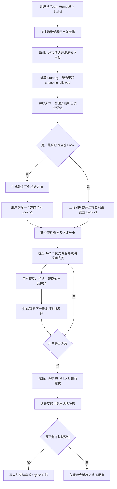

# ProfAgent 私人团队产品需求文档（PRD）

> 产品：以人为本的私人团队 Agent
> 首个核心成员：私人明星穿搭师（`persona_id=stylist`）
> 文档版本：v1.16
> 状态：R1 Demo 与 S6–S15 验收通过；Memory 路线 A 的事务真值、outbox、可重建软索引与确定性重排已完成（合成数据）；LangMem、Mem0、Graphiti 与学习型 reranker 未上线
> 日期：2026-08-19
> 产品代号：ProfAgent
> 当前实现基线：`r1_demo_v1` + `fixtures_v1.0`
> 面向读者：产品、设计、算法、后端、前端、测试、项目评审

---

## 0. 文档说明

### 0.1 文档目标

本文把现有产品构想、市场与竞品结论、工程基线和演进计划统一成一份可用于以下工作的产品基准：

1. 定义 ProfAgent“私人团队”的总产品框架与团队协作边界；
2. 定义首个核心成员——私人明星穿搭师——要解决的用户问题；
3. 明确与 Lookie、搭搭、Whering、Acloset、豆包视频通话和通用大模型的差异；
4. 保留场景推荐与智能衣橱等行业基础能力，同时建立持续沟通、视觉评估和迭代定稿的差异化闭环；
5. 为设计、开发和测试提供可验证的功能与验收口径；
6. 将“私人团队、对话式、角色式”从叙事落实为稳定的产品行为和数据合同；
7. 定义“跨平台候选商品 → 真实衣橱映射 → 2D 整套试演 → 场景评估 → 补购 → 到货反馈”的购前决策闭环；
8. 定义真人穿搭师微咨询、语义穿搭模板和模板自动映射的后续业务边界；
9. 冻结“前期只上线 2D，获得真实收益后才进入 3D 或视频展示”的技术与商业门槛；
10. 区分当前已完成能力、Stylist MVP 必做能力和后续团队成员能力。

### 0.2 相关文档

- `../README.md`：当前 R1 Demo 运行、评测与范围说明；
- `../../01-主项目-支持型私人穿搭师.md`：原始产品需求基线；
- `../../02-检索子系统-Hybrid复用与升级.md`：检索与排序设计；
- `../../05-扩展-多角色预留.md`：多角色扩展边界；
- `../../06-个人开发完整实施与演进方案.md`：14 周工程实施方案。

### 0.3 当前真实状态

截至本文日期，仓库已在原 L0 数据基线上实现并通过 R1 DoD Demo 子集本地验收的 `r1_demo_v1`。它是使用合成数据的产品 Demo；Memory 已有本地 SQLite/可选 PostgreSQL 持久仓储，但 Scene、Look、Trace 等其他状态仍以进程内 Demo 实现为主，不是生产服务：

| 已完成 | 数量/说明 |
|---|---|
| 数据基线 | 3 个虚拟用户、50 件合成衣物、20 套人工/合成套装、50 件 Mock 商品、30 条固定评测样本 |
| 数据能力 | JSON Schema、固定种子 `20260729` 生成、清单哈希、数据校验 |
| Demo 运行时 | FastAPI 单进程提供 API 与中文 Web SPA；`conda run -n torch128 python -m profagent` 一条命令启动 |
| 对话、场景与推荐 | 统一 Dialogue Orchestrator；Enter 发送、Shift+Enter 换行且 IME 不误提交；每个新回合同步最多尝试一次 CPA。推荐回合先由服务端在权威 Scene 与 owner 衣橱上完成 HardFilter、Rule/BM25/Dense/RRF、Assembler 与最终 Validator，再把无内部 ID 的方向摘要交给 CPA 写当前增量回复；明确 1–3 套由服务端解析，否定/纠正可覆盖早先数字，歧义不猜。服务端/浏览器等待上限 120/125 秒；轻度情绪与明确任务同轮处理，只有显式暂停才锁存；高急购物双层门控保持。 |
| 共创闭环 | Team Home、聊天优先的 Stylist Studio、合成衣橱浏览、用户上传单帧静态图的分析、六维 Scorecard、每轮最多两项 Adjustment、不可变 Look 版本、比较/回退、满意定稿 |
| 实验性 Static2D | 图片链路已与文本 transport 解耦，通过 CPA `/images/generations` 固定请求 `grok-imagine-image-quality`；真实成功协议未回报 actual model 时，仅凭 exact request + 受控 CPA receipt + 全图 Validator 接受，并诚实保持 `model_verified=false/resolved_model=null`。50 件合成衣橱已有 owner-bound、内容寻址、schema 2 六键来源 PNG 目录图；衣橱按类别折叠。S14 可在文字方向出现后为 1–3 个权威 outfit 异步生成独立静态 2D 组合参考，单项失败不影响文本或其他图。真实两图约 `7.06s/6.85s`，批量约 `7.13s`；仍不等同真人试穿、身份复刻或精确尺码/面料/垂坠。 |
| 反馈与记忆 | 推荐反馈、拒绝建议去重、受控 `propose → confirm → commit`、敏感默认不写、查看与删除均已实现；Memory 使用本地默认 SQLite、生产可选 PostgreSQL 的事务仓储，支持跨实例确认/恢复、ACL、生命周期、粘性隔离和同事务最小 outbox。硬记忆 SQL 精确读取且不进 RRF；软记忆按 BM25、deterministic hashed Dense surrogate、Recency、Importance weighted RRF，再以 `structured_rerank_v1` 按 RRF/context/specificity/confirmation/lexical 的 `0.60/0.15/0.10/0.10/0.05` 权重确定性重排 Top 5。投影可从 SQL 真值重建，召回仍复验 owner/ACL/有效期。LangMem、Mem0、Graphiti、真实语义 embedding/Cross-Encoder 仍未上线 |
| 可观测与降级 | 当前进程的 Trace 关联 Scene/Recommendation/Look/Scorecard/Adjustment/Final；LLM/Dense 失败回退规则推荐，Catalog 失败无商品，Vision 失败只给定性结果 |
| 固定评测 | `conda run -n torch128 python -m profagent.eval` 一条命令运行 30 条固定样本及确定性对抗 assurance，输出版本化 JSON + Markdown |
| 本地验收 | S15 独立门禁通过：pytest `300 passed`、S15 专项 `19 passed`、Memory 相关 `44 passed`；Urgency `30/30`、高急 Shopping Gate `10/10`、Catalog `0/10`、ID 幻觉 `0/515`、硬约束违反 `0/423`、槽位完整 `74/74`；validate、Node 14 syntax + 7 runtime/static、随机非 8000 HTTP、双实例/重启 SQLite 与真实浏览器 Memory DOM 全绿，CPA 调用为 0。S14 的连续两套 owner 衣橱推荐与真实 CPA 两图证据仍保持。 |

运行限制与真实边界：Web 固定演示合成用户 `u01`；Demo 没有生产级身份认证、Scene/Look/Trace 主数据库、对象存储、Redis 或合规级持久审计。已确认 Memory 可通过 SQLite 跨进程恢复并可选 PostgreSQL，但反馈、Look、Trace 和其他 session 状态在重启后仍会丢失；对话 session 使用最长 30 分钟滑动 TTL。为保证并发同 request 严格 single-flight，R1 暂时串行所有 Dialogue 回合，不代表生产吞吐设计；衣橱界面以浏览/筛选为主而非完整编辑工作台；Final 的穿后状态仍为 `pending`。用户上传的当前穿搭图仅在当前进程内临时保存并支持删除；启用 Vision 时会按显式同意发送到配置的 CPA。Static2D 当前只生成中性无身份模特或平铺参考，任何身份参考图都不发送给生图 Provider。Catalog 仅使用合成 Mock 商品。CPA 对话 Provider 的逻辑模型为 `grok4.6`、transport 为 `grok-4.6-high`，应用只接受显式精确 allowlist `{grok-4.6-high, grok-4.6-build}`；图片 Provider 独立固定请求 `grok-imagine-image-quality`，真实协议未回报 actual model 时不会伪造 resolved 值。任务内量体信息只保留在当前 owner-bound session，不进入长期记忆或 Trace 原值；该门控不等同完整 DLP。

完整 R2 购前试演（外部候选商品导入、身份保持真人试穿、多场景对比与到货反馈）、第二专业成员与实际团队转交、真人专家、语义模板市场、真实购物/支付、3D、360°和视频均**未上线**，不得在对外材料中描述为已经完成。当前实验性 Static2D 仅用于验证“既有 Look → 中性无身份 2D 风格参考”的 CPA 技术链路，不属于 R1 DoD，也不代表完整 R2 已完成。

### 0.4 版本记录

| 版本 | 日期 | 变更 |
|---|---|---|
| v1.0 | 2026-08-03 | 首个完整 PRD；加入 Lookie 竞品响应、角色连续性、关键场合决策定位和产品指标 |
| v1.1 | 2026-08-04 | 升级为私人团队框架；穿搭师改为首个成员；加入实时视觉评估、情境化打分、细节调整、版本复评和用户满意闭环 |
| v1.2 | 2026-08-04 | 加入衣橱感知的跨平台购前试演、补购与到货反馈闭环；加入真人造型师微咨询和语义模板市场路线；冻结前期 2D 静态展示、收益验证后才进入 3D/视频的阶段门槛 |
| v1.3 | 2026-08-04 | 同步本地 `r1_demo_v1` 候选实现、运行/评测命令与真实限制；所有 R2+ 能力继续明确标记为未上线 |
| v1.4 | 2026-08-06 | 同步本地 R1 Demo 子集最终验收、固定指标与 Codex/Grok 相互验证证据；不改变产品语义和 R2+ 未上线边界 |
| v1.5 | 2026-08-06 | 关闭真实浏览器先于 CPA 降级而中止的运行缺陷；冻结 Health/Scene/Vision 交互预算、中文安全重试与取消清理，范围与指标门槛不变 |
| v1.6 | 2026-08-06 | 关闭澄清轮输入残留与轻度紧张场景误分类：发送后清空输入，同 session 第二轮只提交新增信息并继承上下文；保持整体无助表达的本地支持流与既有安全门槛 |
| v1.7 | 2026-08-06 | 将 Stylist 从表单式推荐链路重构为会话优先角色：统一回合编排、支持暂停/恢复/终止、受控非重复情绪承接、显式纠正、session TTL、幂等与 Trace 隐私；专业工具只在本轮计划允许时调用 |
| v1.8 | 2026-08-07 | S6 将每个新对话回合改为 CPA-first 自然回复，并在本地保留状态机、安全门控与工具权威；加入实验性 Static2D CPA 纵切、AI 标识、临时资产删除和身份图片不发送边界；同步 140 项全量测试与复审结果，不把完整 R2、真人试穿、3D/360°/视频标为已上线 |
| v1.9 | 2026-08-07 | S7 修正“轻度情绪抢占穿搭任务”、普通聊天后任务恢复、显式暂停锁存、任务内量体信息、可选 advisory 隔离和来源标签；服务端拒绝量体原值复述及人物比例评价，同步 180 项全量测试与最终复审证据 |
| v1.10 | 2026-08-07 | S8 将同步 Dialogue 可见回复控制在 5 秒内：服务端 CPA 预算 3.5 秒、浏览器 4.5 秒，业务超时不跨回合熔断；修正“等会儿”等近时表达与重复情绪承接，同步 196 项全量测试和真实 8000 墙钟证据 |
| v1.11 | 2026-08-10 | S9/S10 按用户最新口径改为同步等待完整 CPA 结果（服务端 120 秒、浏览器 125 秒），修复长等待防重入、reset/Trace 竞态与 CPA 正文二次改写；按 CPA 当前别名迁移 transport 为 `grok-4.5-high`，同步 203 项测试和真实 8000 CPA 墙钟证据 |
| v1.12 | 2026-08-18 | 冻结 S12：未上线个人开发阶段继续 CPA-first；图片与文本模型解耦，专用 CPA 图片模型固定为 `grok-imagine-image-quality`；记忆采用 PostgreSQL-ready 真值、硬记忆精确读取、软记忆 BM25/Dense/Recency/Importance weighted RRF + 轻量重排。此版本记录实施中合同，不提前宣称完成 |
| v1.13 | 2026-08-18 | 关闭 S12/S12R 本地实现与验收：真实 CPA Image 成功响应不回报顶层模型名，改为 request-bound receipt 验证且不伪造 actual/resolved；50 件目录资产迁移为 schema 2 六键来源、内容寻址 URL 与 prompt-hash 未保留声明；SQL Memory/RRF、246 项测试和单命令原子报告全绿 |
| v1.14 | 2026-08-19 | 关闭 S13：文本 CPA 精确迁移为 `grok4.6 → grok-4.6-high → {grok-4.6-high,grok-4.6-build}`；修复衣橱目录图 hidden+lazy 加载死锁，真实浏览器 `naturalWidth=1024`；252 项全量、214 项定向、固定 eval 与真实 8000 CPA 冒烟全绿；Grok 4.6 外部审查建议由 Codex 逐项本地验证并以 0/0/0 关闭 |
| v1.15 | 2026-08-19 | 关闭 S14：推荐回合先基于 owner 衣橱生成权威方向再由 CPA 表达，支持 1–3 套否定/纠正/歧义边界；增加推荐级并行静态 2D、Enter/Shift/IME 和类别折叠。278 项全量、26 项专项、241 项相关门禁、真实 Chrome 与真实 CPA 两图通过；Memory 仅完成四路线调研，待用户确认。 |
| v1.16 | 2026-08-19 | 关闭 S15 Memory 路线 A：增加生命周期/来源闭集、粘性隔离、事务 outbox 与幂等 consumer、可重建 ID-only 软投影、PostgreSQL/SQLite 并发真值和 `structured_rerank_v1`；300 项全量、19 项专项、44 项相关、真实 Chrome 与双实例/重启门禁通过。B/C/D 与学习型 reranker 继续未上线。 |

---

## 1. 产品摘要

### 1.1 总产品一句话定位

> ProfAgent 是一个以用户为中心的私人团队：不同专业成员共享用户授权的长期信息，并像真实顾问团队一样通过持续沟通、观察、方案迭代和复盘帮助用户完成生活决策。

### 1.2 首个成员：私人明星穿搭师

> 私人明星穿搭师既具备场景推荐和智能衣橱，也能像真实造型师试装一样：先理解用户想表达什么，再给方向；观察用户当前穿搭，按场景给出可解释评分；一次只调整最有价值的细节；用户试穿或反馈后继续复评，直到用户明确满意并定稿。

“明星穿搭师”描述的是服务水准和工作方式，不代表系统冒充真人、明星本人或拥有现实从业经历。

### 1.3 用户价值主张

> 不是把一套答案扔给你，而是和你一起把这套穿搭调到满意。

### 1.4 外部宣传候选

- 总产品：**一个真正围绕你工作的私人团队。**
- 穿搭师主标题：**不是替你穿，而是和你一起把这套穿到满意。**
- 穿搭师副标题：**懂场景、懂衣橱，也会看着你一点点调整细节。**
- 信任表达：**评分只评价这套穿搭是否适合你的目标，不评价你的长相和身体。**
- 购前能力：**先把想买的衣服搭进你的真实衣橱，再决定要不要买。**
- 2D 可信表达：**先看整体风格和场景效果；尺码、面料与垂坠仍以真实试穿为准。**
- 对 Lookie 的差异表达：**Lookie 帮你生成和试穿；ProfAgent 陪你试、陪你改，直到你愿意穿出门。**

### 1.5 产品形态

| 阶段 | 形态 |
|---|---|
| R0 数据基线 | Python 数据、Schema、规则和评测集 |
| R1 Stylist MVP | 私人团队外壳 + Stylist 成员；场景推荐、智能衣橱、图片评估、评分卡和多轮调整闭环 |
| R2 2D Decision Preview Pilot | 轻量 Web/移动端体验；渐进式衣橱、候选商品导入、2D 静态整套试演、多场景卡片、穿搭版本对比和真实用户试用 |
| R3 Expert & Team Pilot | 接入第二个已验证团队成员；同时以小规模白名单方式试点真人造型师异步微咨询，不开放大众市场 |
| R4 Template & Commerce Pilot | 语义穿搭模板、衣橱自动映射、真实商品目录、净保留 GMV 结算和低急切度商业验证；展示仍以 2D 为主 |
| R5 Reality Enhancement | 仅在达到收益门槛后评估 3D、多角度物理模拟、生成视频或实时视频展示，使展示进一步接近真实场景 |

---

## 2. 背景与问题定义

### 2.1 用户问题

现有穿搭产品主要解决“整理衣橱”“按场景生成搭配”“寻找灵感”“虚拟试穿”或“购买新衣”。这些已经成为穿搭产品的基础能力，ProfAgent 同样必须具备，但不能停在这里。用户在真实场景中面对的完整问题是：

> 我已经有衣服，也得到了一套推荐，但它不一定像我、不一定适合我现在的状态。我需要一个能看见我、听懂我，并根据我的试穿反应继续修改，直到我满意的造型师。

典型困难包括：

- 用户描述的不是结构化筛选条件，而是“下午要面试，有点慌，别让我显得太老气”；
- 天气、场合、干净状态、舒适度、禁忌和时间常同时发生冲突；
- 灵感越多，决策负担越大；
- 通用大模型会推荐用户并不拥有的衣物；
- 一次性推荐无法看到衣服真正穿在用户身上的比例、层次和细节；
- 用户说“太正式”“不像我”后，系统常重新生成另一套，而不是沿着当前方案精细修改；
- 单一总分容易变成对人的审美评判，忽略用户自己的表达目标；
- 购物导向产品会在用户即将出门时继续推荐购买；
- 电商模特图经过身材、姿势、角度、灯光和后期优化，用户无法判断待购商品与自己的身体、已有衣橱和真实场景是否协调；
- 平台内试穿与订单导入通常被单一生态锁定，用户在淘宝、京东、抖音、小红书或线下看到的候选无法进入统一决策；
- 真人穿搭咨询散落在博主私信和微信中，价格、交付、修改、退款和评价不标准，专业经验也难复用到其他用户的真实衣橱；
- 一次性的推荐不会记住用户真正拒绝某套搭配的原因；
- 衣橱建档工作量过高，用户在获得首次价值前已经流失。

### 2.2 核心机会

ProfAgent 采用三层产品战略：

| 层 | 作用 | 必须具备 |
|---|---|---|
| 行业基础层 | 达到用户对穿搭产品的最低预期 | 智能衣橱、场景/天气推荐、穿搭历史、反馈、可选补购 |
| 核心体验层 | 建立可感知差异 | 对话理解、2D 静态图片观察、穿搭评分卡、逐项调整、复评和满意定稿；视频仅在 R5 收益门槛后评估 |
| 私人团队层 | 形成长期产品框架 | 团队入口、专业成员、共享用户档案、角色记忆隔离、透明协作和授权转交 |
| 决策商业层 | 在不破坏信任的前提下验证收入 | 2D 衣橱感知购前试演、场景对比、真实结果回流、真人专家、语义模板和净保留结算 |

要占领的心智不再只是“关键场合给我三套”，而是：

> **像私人造型师一样，陪我把一套穿搭从想法调到满意。**

可靠性由七个同时成立的条件构成：

1. 理解用户的处境、情绪和隐含约束；
2. 推荐只来自真实、可用的个人衣橱；
3. 硬约束不可被模型或排序覆盖；
4. 高急切度不进入购物链路；
5. 视觉评分评价“当前穿搭与用户目标的匹配”，不评价用户本人；
6. 每次调整都说明原因、记录版本，并接受用户否决；
7. 推荐、试穿、调整、满意度和长期记忆形成连续关系。

### 2.3 为什么现在做

- 数字衣橱和 AI 造型需求已由多家产品验证；
- 大模型使自然语言场景理解和支持型对话可用；
- 实时视觉对话使“边看边聊、边试边改”成为大众可以理解的交互方式；
- 传统衣橱 App 的交互仍以表单、卡片和功能页为主；
- 平台型竞品拥有商品和订单数据，独立产品更需要从“可信决策关系”建立差异；
- 现有代码已经具备可复现数据、硬规则和评测基础，适合先做小而完整的闭环。

---

## 3. 市场与竞品结论

> 数据观察截止 2026-08-04。公开用户数、下载量和评分的口径不同，不得作为经审计市场份额使用。

### 3.1 市场信号

| 产品 | 公开规模信号 | 核心能力 | 对 ProfAgent 的含义 |
|---|---:|---|---|
| [Whering](https://www.whering.co/) | 官方称超过 1000 万用户 | 数字衣橱、天气、规划、社区、再利用 | 基础衣橱与日常推荐已商品化 |
| [Acloset](https://www.acloset.app/zh-cn/) | 官方称超过 700 万用户 | 自动建档、AI 搭配、衣橱统计 | 自动识别和通用推荐不是独立壁垒 |
| [搭搭](https://apps.apple.com/cn/app/%E6%90%AD%E6%90%AD-%E8%A1%A3%E6%A9%B1%E6%94%B6%E7%BA%B3%E7%AE%A1%E7%90%86ai%E5%B7%A5%E5%85%B7/id1616484963) | 官方商店文案称 200 万用户 | 中文电子衣橱、天气、规划、统计、AI 试搭 | 中国本土直接竞品，功能覆盖完整 |
| [Style DNA](https://techcrunch.com/2024/06/21/style-dna-generative-ai-fashion-stylist-app/) | 2024 年披露 320 万下载、30 万活跃、7 万付费 | 风格画像、AI 造型、购物 | 下载到持续使用是行业核心难题 |
| [Alta](https://techcrunch.com/2025/06/16/alta-raises-11m-to-bring-clueless-fashion-tech-to-life-with-all-star-investors/) | 2025 年融资 1100 万美元 | 衣橱、日历、天气、预算、场合、虚拟形象 | “AI 私人造型师”叙事已被占领 |
| [Lookie](https://apps.apple.com/cn/app/lookie-your-ai-stylist/id6738732136) | 中国 App Store 4.8 分、约 860 个评分；未发现可核验用户总量 | 淘宝订单导入、电子衣橱、AI 搭配、试穿、社区、加购 | 中国区最高优先级战略竞品 |
| [豆包视频通话](https://finance.ce.cn/home/jrzq/dc/202505/t20250523_2293202.shtml) | 2025 年上线实时视频问答，穿搭玩法在 2026 年形成大量用户内容 | 边看边聊、直接观察衣柜和当前穿搭 | 验证实时视觉共创需求，也暴露专业约束和审美一致性不足 |

### 3.2 Lookie 重点分析

Lookie 的 App Store 页面显示其开发者为杭州万相创意科技有限公司，版权标注为淘宝（中国）软件有限公司。其 2025 年 10 月后的版本已经加入电子衣橱、淘宝订单导入、加购、DIY 搭配和 AI 搭配。

2026 年 6 月，[Lookie 官方](https://www.xiaohongshu.com/explore/6a3cecf4000000001102ffe9)进一步发布了点赞、点踩和“不喜欢原因”，原因包括需求无关、搭配不完整、色彩不和谐、风格不统一、排版问题和季节不匹配。因此“有反馈”不能再单独作为 ProfAgent 的差异化。

Lookie 的优势：

- 淘宝订单、商品详情、加购和图片资产；
- 低摩擦导入平台内已购商品；
- 虚拟试穿、发型发色、写真和社区带来的视觉传播；
- 平台可持续补齐常规 AI 推荐与反馈能力。

Lookie 当前公开体验中未体现的核心能力：

- 通过自然语言多轮对话理解复杂处境；
- 一个具有长期连续性的固定角色关系；
- 高急切度强制关闭购物链路；
- 硬约束、衣物状态和推荐 ID 的可验证性；
- 将“拒绝原因”转化为跨场景、可治理的长期记忆；
- 在选择过载时主动收敛并完成决定。

### 3.3 竞争定位图

| 类型 | 代表 | 用户得到什么 | ProfAgent 的应对 |
|---|---|---|---|
| 衣橱管理型 | Whering、Acloset、搭搭 | 整理、统计、日常灵感 | 不拼功能大全；切关键场合决策 |
| 图片与试穿型 | Lookie、Doppl 等 | 看见不同造型效果 | 试穿降级为推荐后的可选预览 |
| 商业导购型 | Lookie、Alta、购物平台 | 发现和购买商品 | 用“高急切度不购物”建立信任 |
| 通用多模态对话型 | ChatGPT、豆包等 | 自然语言建议、看图/视频即时反馈 | 吸收边看边聊体验，用真实衣橱、专业评分框架、版本迭代和长期记忆补足可靠性 |
| 人类造型服务 | Indyx、线下造型师 | 人类审美和关系 | 提供低成本、随时可用的决策支持；不冒充真人 |

### 3.4 豆包视频穿搭的产品启示

豆包在 2025 年上线实时视频通话，使用户可以打开摄像头，让模型直接观察真实场景并持续交流。2026 年初，大量用户将这一通用能力自发用于展示衣柜、评价当前穿搭和现场修改，这说明“边看边聊”比上传后等待一张结果图更接近真实顾问体验。

同时，公开热门案例也显示了通用模型的失败模式：反复要求卷裤脚、不断堆叠配饰和穿法、忽视用户是否真的喜欢，最后对失控造型仍给出正向评价。[相关案例报道](https://www.sohu.com/a/983365068_100024718)

ProfAgent 应吸收其交互优势，但建立以下专业约束：

1. 每轮最多提出 1–2 个高价值调整，不堆叠所有技巧；
2. 用户否决过的建议在本次会话中不得原样重复强推；
3. 每次调整前说明预期改善的具体维度；
4. 调整后必须对比前一版本，而不是无条件夸奖；
5. 评分不以“时尚元素越多越高”为目标；
6. 用户满意度高于系统分数，用户可以在任何分数下定稿；
7. 重要场景继续遵守衣橱、天气、禁忌和购物门控。

该启示首先通过“静态图片 + 连续对话/语音 + Look 版本”落地，而不是立即复制实时视频。R1–R4 使用 2D 静态证据完成边看边改；实时视频只作为 R5 收益门槛后的体验增强候选。

### 3.5 差异化结论

ProfAgent 不将以下能力视为长期壁垒：

- AI 搭配；
- 天气推荐；
- 电子衣橱；
- 点赞和点踩；
- 虚拟试穿；
- 简单的人格 Prompt。

长期壁垒应来自：

1. 场景与约束 → 初始方向 → 试穿版本 → 评分卡 → 调整动作 → 复评 → 满意定稿 → 实际穿着的数据闭环；
2. 可验证的硬规则与自动化评测；
3. 用户可控的长期偏好、情境和关系记忆；
4. 角色在多轮决策中的行为连续性，而非仅有固定语气；
5. 在购物利益冲突中始终执行的紧迫度门控；
6. 私人团队不同成员之间经用户授权后形成的共享理解与专业分工。

### 3.6 新赛道一：衣橱感知的跨平台购前试演

该赛道不是全球空白。海外已经出现接近完整链路的消费产品，国内也已具备强平台能力和大量早期独立应用；可切入点不是“首次提供 AI 试衣”，而是把分散能力组织为一个中立、可信、可持续学习的购前决策闭环。

| 市场 | 成熟度判断 | 代表产品与已验证能力 | 尚未被稳定解决的问题 |
|---|---|---|---|
| 海外 | 功能中高；商业和降退货效果仍未充分验证 | [Aesty](https://apps.apple.com/us/app/aesty-ai-stylist-planner/id6502579395) 已支持从社交截图识别单品、本人/分身试穿、与现有衣橱混搭、只购买缺失项和场景方案；[Alta](https://apps.apple.com/us/app/alta-daily-digital-ai-closet/id6481705400) 支持收据/照片导入、日程天气、衣橱缺口与本人试穿；[Google Photos Wardrobe](https://blog.google/products-and-platforms/products/photos/google-photos-wardrobe-feature/) 支持从个人照片整理衣物、最多六件组合和虚拟试穿 | 任意渠道稳定导入、本人整套高保真试演、实时商品补缺、场景决策、尺码/面料置信度与到货真实反馈尚未被一个产品完整打通 |
| 中国 | 平台单点能力高；中立独立产品闭环中低 | [淘宝/千问](https://www.alibabagroup.com/en-US/document-1991231293551017984)已串联平台商品、对话、多件混搭、本人试穿与下单；[Lookie](https://apps.apple.com/cn/app/lookie-%E6%B7%98%E5%AE%9D%E6%99%BA%E8%83%BD%E7%94%B5%E5%AD%90%E8%A1%A3%E6%A9%B1-ai%E6%90%AD%E9%85%8D%E5%8A%A9%E6%89%8B/id6738732136) 支持淘宝订单、衣橱、搭配、试穿和加购；[爱搭衣橱](https://apps.apple.com/cn/app/%E7%88%B1%E6%90%AD%E8%A1%A3%E6%A9%B1-%E7%94%B5%E5%AD%90%E8%A1%A3%E6%A9%B1-ai%E6%90%AD%E9%85%8D-ai%E8%AF%95%E8%A1%A3/id6747186089) 支持网页导入、真实衣橱、天气场景和新品试搭 | 跨淘宝/京东/抖音/小红书的中立导入、已有衣物与待购商品同图整套试演、对话持续改版、场景适配解释和实际留货/退货反馈仍碎片化 |

公开资料不足以计算可信市场份额。下载量、应用评分和公司自报用户数只作为采用规模代理，不得写成市场占有率。对 ProfAgent 的产品结论为：

1. 将该能力命名为“购前穿搭试演”或“衣橱感知的购物决策”，不使用“精准合身试衣”承诺；
2. 前期以用户分享商品页、粘贴链接、订单截图和授权商品源导入，不把未经许可的跨平台爬取作为长期数据方案；
3. 同一张 2D 整套效果图可以同时包含用户已有衣物与待购商品，并回答“买它后能与现有衣橱组成多少套”；
4. 场景切换必须重新计算正式度、天气、活动强度、舒适性和文化约束，不能只替换背景；
5. 到货后收集真实穿着、保留/退货及原因，用于校准特定用户、品牌和版型；
6. 只验证降低“风格、场景或无法搭配”导致的退货，不承诺解决精确尺码、面料触感和真实垂坠。

### 3.7 新赛道二：真人造型师与语义穿搭模板

海外已经分别验证真人付费咨询、数字衣橱、可购物 Lookbook、模板订阅和本人整套预览，但尚未发现公开证据证明某一产品已完整打通“造型师模板 → 用户衣橱自动映射 → 只补缺口 → 本人试演 → 对话修改 → 原造型师确认”。中国的内容与私域服务供给丰富，但标准化数字平台更弱，因此国内切入窗口相对更大。

| 类型 | 代表 | 已验证能力 | ProfAgent 可攻击的缺口 |
|---|---|---|---|
| 最接近直接竞品 | [Indyx](https://apps.apple.com/us/app/indyx-wardrobe-outfit-app/id1599179405) | 数字衣橱、真人造型师、已有衣物与新品 Lookbook、公开评价和 Virtual Selfies | 主要是按用户定制，缺少造型师可规模复用、自动映射到每个用户衣橱的语义模板市场 |
| 造型师工作台 | [GetWardrobe](https://help.getwardrobe.com/latest/stylists/client-wardrobes/)、[Hue & Stripe](https://hueandstripe.com/about) | 造型师进入客户数字衣橱、创建可购物 Lookbook、推荐新品和获得联盟佣金 | 偏 B2B SaaS，不是统一消费者发现、订阅和复购关系平台 |
| 真人咨询与内容订阅 | [Wishi](https://www.wishi.me/pricing)、[Glamhive](https://glamhive.com/pages/personal-styling-services)、[Fashivly](https://fashivly.com/pages/faqs) | 人工聊天修改、可购物 Style Board、高价一对一和低价真人穿搭内容库 | 衣橱映射、本人试演、版本化交付和一对多知识复用没有形成同一闭环 |
| 中国局部竞品与替代品 | 慧衣橱、搭搭、小红书/抖音博主与微信私域咨询 | 形象顾问、衣橱工具、社区帮搭、低价一对一服务和内容种草 | 价格、资质、交付物、修改次数、退款、衣橱数据、模板复用和效果评价缺乏统一标准 |

真人业务的核心产品对象不是静态拼图，而是“语义穿搭配方”：

- 定义上装、下装、外套、鞋、包、配饰等角色槽位；
- 定义场景、风格、正式度、季节、预算、舒适度、体型注意事项和替代规则；
- 系统优先使用用户已有衣物填充槽位，显示衣橱匹配率；
- 只对缺失槽位推荐可购买商品，并生成 2D 整套试演；
- 用户可通过对话要求“更显高、不要露腿、改成通勤、预算减半”，AI 先改版，必要时由同一真人确认。

R3 前不建立开放造型师市场。先邀请 5–10 名经人工验证的造型师，测试 AI 初稿 + 真人异步微调的人效、满意度和付费意愿；只有服务质量和单位经济成立后，才扩大供给并上线模板交易。

### 3.8 中外差异带来的进入判断

| 赛道 | 国内是否仍可切入 | 进入条件 | 不成立的信号 |
|---|---|---|---|
| 衣橱感知购前试演 | 有条件可切入，窗口正在收窄 | 中立跨平台导入、真实衣橱、对话共创、2D 整套试演、场景解释和到货反馈形成一条顺滑链路 | 用户只把功能当生成图片娱乐；2D 结果降低信任；平台封闭使商品导入不可持续；无法证明净保留价值 |
| 真人造型师与模板 | 国内切入机会更强，但不代表更容易 | 把真人经验结构化为可映射配方，以 AI 降低单次人力，并建立标准交付、评价和净保留 GMV 激励 | 免费博主内容已足够替代；用户不愿付费；真人分钟成本和获客成本无法被模板复用覆盖 |

工程顺序与市场叙事需要分开：工程上先建设衣橱、商品候选和 2D 试演底座；市场上以“长期陪伴的 AI 穿搭师 + 按需真人专家”作为更强差异，而不是宣传拥有另一项通用虚拟试衣能力。

### 3.9 商业与退货证据边界

- [NRF 2025 Retail Returns Landscape](https://nrf.com/research/2025-retail-returns-landscape)预计美国 2025 年线上销售退货率为 19.3%，说明购买前不确定性是大问题，但该数据不是服装单一品类，也不能直接推导 ProfAgent 的可节省金额；
- [中国市场监管总局公开数据](https://www.samr.gov.cn/xw/zj/art/2026/art_c669e8b73a21493b913752ca515cc261.html)持续把服装鞋帽、货不对板、质量和售后列为网络消费高发问题；平台和媒体报道中的女装/直播高退货率口径差异很大，只能作为严重场景信号，不能写成全国市场份额；
- 虚拟试穿可能降低部分退货，也可能因为提高购买和尝试意愿而增加订单与退货。2026 年一项 112,473 笔高风险交易的随机实验实现退货率下降 3 个百分点，干预是结构化适配提醒而不是生成式效果图，[研究 DOI](https://doi.org/10.1016/j.jretconser.2026.104828)；
- [Stitch Fix 2025 年报](https://www.sec.gov/Archives/edgar/data/1576942/000162828025042782/sfix-20250802.htm)披露约 230.9 万活跃客户和约 13 亿美元收入，同时活跃客户继续下降且仍有净亏损，既证明真人 + 算法造型有付费需求，也警示人力、留存和履约模型；
- 创作者可购物内容已经被 [LTK](https://company.shopltk.com/hubfs/LTK%20Fact%20Sheets.pdf) 等平台验证为大规模需求，但创作者带动销售不等于用户愿意为专业造型服务付费，更不能用下单 GMV 代替退货后的真实贡献。

因此，PRD 不采用宽泛咨询报告给出的虚拟试衣或造型市场 TAM 作为主要论据，也不提供无法审计的竞品市场份额。商业成功以真实付费、贡献利润、已有衣橱利用率、实际穿着、净保留 GMV、风格原因退货和真人分钟成本验证。

---

## 4. 产品战略

### 4.1 首个市场切口

首批目标人群：

> 22–35 岁的一二线城市职场新人、职业转换者和年轻专业人士；已经拥有足够衣物，但在面试、汇报、见客户、入职第一天和商务出差前容易产生决策焦虑。

选择该人群的原因：

- 场景时间点和任务完成标准明确；
- 穿错的心理与职业成本高于普通日常场景；
- “最终是否穿出门”可以验证推荐价值；
- 已有衣物数量足够，问题主要是组合与决策而非缺货；
- 内容传播可以围绕具体故事，而不是泛化穿搭灵感。

### 4.2 首发场景优先级

| 优先级 | 场景 | 主要目标 |
|---|---|---|
| P0 | 面试 | 可靠、精神、不过度成熟、舒适 |
| P0 | 汇报/重要会议 | 专业、可信、行动方便 |
| P0 | 入职第一天/见客户 | 融入环境、有分寸、有记忆点 |
| P1 | 商务出差 | 天气、行程、多日复用、少带衣物 |
| P1 | 约会/重要社交 | 自信、符合本人、不用力过猛 |
| P2 | 普通通勤 | 形成日常留存，不作为首发传播核心 |
| P2 | 旅行与补购 | 低急切度时验证购物缺口 |

### 4.3 不优先服务的人群

- 主要目标是时尚内容创作或大量造型探索的用户；
- 只需要虚拟试衣图片、不需要真实穿搭决策的用户；
- 希望系统替代医疗、心理咨询或身体诊断的用户；
- 专业造型师工作台和品牌/零售 B2B 客户；
- 需要精确尺码、垂感或合身度预测的用户。

### 4.4 私人团队模型

ProfAgent 的外层不是“若干互不相关的 Chatbot”，而是同一个用户拥有的一支长期私人团队。

| 组件 | 产品职责 |
|---|---|
| Team Home | 统一入口，展示当前任务、团队成员和正在进行的会话 |
| Team Orchestrator | 判断任务属于哪个专业成员；不以独立人格与用户争夺注意力 |
| Professional Member | 在明确专业边界内提供服务；首个成员为 Stylist |
| Shared User Profile | 保存用户明确授权、对多个成员都有价值的稳定信息 |
| Member Memory Namespace | 保存成员专业域内的历史、偏好、会话版本和反馈 |
| Consent & Handoff | 跨成员共享或转交前说明分享什么、为什么，并允许用户拒绝 |

R1 只完整交付 Stylist，但以下团队合同必须从第一版存在：

- `team_id`、`member_id/persona_id`、任务归属和会话归属；
- 共享档案与成员记忆分离；
- 工具权限按成员隔离；
- 非穿搭任务不由 Stylist 假装全能回答；
- 后续成员可以接入而不重写 Stylist 的数据与评测链路。

R1 不需要角色大厅，也不需要为了证明“团队”而上线多个半成品角色。

真人造型师属于按需调用的外部专业服务网络，不默认成为用户私人团队中的长期 Agent 成员。AI Stylist 继续拥有会话主导权、用户关系、衣橱数据和版本历史；真人专家只在用户明确选择且授权必要字段后，审核某个 Look、模板映射或关键决策。真人不得获得未授权的完整会话、人像原图或其他成员记忆。

### 4.5 产品原则

| 原则 | 产品含义 |
|---|---|
| 基础能力不能缺 | 场景推荐、智能衣橱、天气、历史和反馈属于行业入场券 |
| 共创优先于一次性答案 | 初始方案是可修改草案；通过试穿、对话和复评共同定稿 |
| 满意优先于高分 | 分数用于解释变化，不强迫用户追求系统定义的“满分” |
| 评价穿搭，不评价人 | 不给颜值、身材或人格打分；评分只针对当前目标下的方案表现 |
| 少量高价值调整 | 每轮最多给 1–2 个优先调整，避免堆技巧导致造型失控 |
| 真实衣橱优先 | 每件推荐都来自合法衣橱 ID；用户看名称/图片，系统保留可追溯 ID |
| 硬规则优先于模型 | 禁忌、库存、状态、场合、天气必需项和购物门控不可被排序覆盖 |
| 高急切度不购物 | `now/today/unknown` 禁止 Catalog 调用和购物 CTA |
| 先承接，再行动 | 情绪承接最多一小段，随后明确场景并推进决定 |
| 团队统一、专业分工 | 用户拥有一个私人团队；每个成员只在专业边界内工作 |
| 首个成员做深 | MVP 只完整实现 Stylist，但团队合同和共享档案从第一版存在 |
| 记忆可见、可改、可删 | 敏感信息不自动保存；用户拥有最终控制权 |
| 先给价值，再补衣橱 | 不要求用户在首次推荐前完整数字化衣柜 |
| 可解释但不过载 | 每个初始方向说明关键依据、风险与替换，不展示算法术语 |
| 增强能力可降级 | LLM、Dense、排序模型或试穿失败时，核心规则推荐仍可工作 |
| 预览不是承诺 | 2D 生成图用于判断整体风格和场景适配；不宣称能证明精确尺码、面料触感或真实垂坠 |
| 2D 先行、收益后升维 | R1–R4 的消费者展示以静态 2D 为主；在真实收入与正向单位经济成立前，不开发 3D 或视频展示 |
| 真人经验可计算 | 造型师交付优先沉淀为带槽位、约束和替代规则的语义穿搭配方，而非不可复用的静态拼图 |
| 按净保留价值激励 | 造型师、创作者和商品佣金应尽量在退货期后按净保留 GMV 或实际服务价值结算，不以冲动下单 GMV 为唯一目标 |

---

## 5. 用户与核心任务

### 5.1 核心用户画像 A：关键场合决策者

| 属性 | 描述 |
|---|---|
| 年龄/阶段 | 22–30 岁，求职、转岗或职场早期 |
| 衣橱状态 | 30–100 件常用衣物，拥有足够单品但缺乏组合信心 |
| 行为 | 临出门反复换衣，向朋友发照片询问，搜索“小红书面试穿搭” |
| 痛点 | 信息很多但不能映射到自己拥有的衣服；害怕不合场合 |
| 目标 | 快速选定一套、减少焦虑、保持“像自己” |
| 成功标准 | 与 Stylist 共同定稿一套自己满意的方案，实际穿出门并认为符合当时目标 |

### 5.2 核心用户画像 B：高频专业场景用户

| 属性 | 描述 |
|---|---|
| 年龄/阶段 | 27–35 岁，需要汇报、见客户或出差 |
| 衣橱状态 | 通勤衣物较多，但重复穿固定组合 |
| 痛点 | 天气、正式度和连续多日行程难统筹；没时间重新研究 |
| 目标 | 稳定、省时、复用已有衣物，并逐渐扩大可用组合 |
| 成功标准 | 减少准备时间，提高旧衣复用率，重要场景无明显失误 |

### 5.3 次级用户画像：衣橱沉睡用户

| 属性 | 描述 |
|---|---|
| 行为 | 衣服多但总穿同样的 20%；试过电子衣橱但放弃录入 |
| 痛点 | 建档成本高，AI 推荐重复或“不像真人会穿” |
| 目标 | 从少量高频衣物起步，逐步获得新组合 |

### 5.4 Jobs to Be Done

| JTBD ID | 当…… | 我想…… | 从而…… |
|---|---|---|---|
| J1 | 我很快要参加重要场合并有些紧张 | 让一个懂我的造型师根据现有衣物快速收敛选择 | 我能准时、安心地出门 |
| J2 | 我的限制很多但说不清楚 | 用自然语言描述处境，由系统提取真正重要的约束 | 我不用填写复杂筛选表 |
| J3 | 我不喜欢某次推荐 | 告诉系统具体原因并看到下一次结果改变 | 我不用反复重新解释自己 |
| J4 | 我计划几周后的旅行或活动 | 先复用衣橱，再识别确实存在的缺口 | 我不会被诱导重复购买 |
| J5 | 我担心系统记住隐私 | 查看、确认或删除被保存的记忆 | 我仍然控制个人数据 |
| J6 | 我已经穿上一套但觉得哪里不对 | 让 Stylist 看当前效果、给出情境化评分并一次调整少量细节 | 我可以看见每次修改为什么更接近目标 |
| J7 | 我的需求跨越不同生活领域 | 由私人团队把任务交给合适成员，并在我授权后复用必要信息 | 我不必面对多个彼此失忆的工具 |
| J8 | 我在任意平台看到一件想买的衣服 | 把它与我的真实衣橱放进同一套 2D 效果图并切换场景比较 | 我能在购买前判断它是否真的补足衣橱，而不是只看模特图冲动下单 |
| J9 | 我喜欢某位真人造型师的搭配方法 | 把其穿搭配方自动替换为我已有的衣物，并只补齐缺失槽位 | 我不需要逐件搜索，也能获得兼具专业背书和个人适配的完整方案 |

---

## 6. 产品目标、指标与非目标

### 6.1 R1 MVP 产品目标

| ID | 目标 |
|---|---|
| G1 | 建立 Team Home、成员合同、共享档案和成员记忆隔离；R1 完整交付 Stylist |
| G2 | 具备竞品同类基础能力：智能衣橱、场景/天气推荐、穿搭历史、反馈和条件补购 |
| G3 | 用户通过自然语言与图片完成“理解目标 → 初始方向 → 当前穿搭评估 → 调整 → 复评 → 满意定稿”闭环 |
| G4 | 高急切度和截止时间未知时绝不进入购物链路 |
| G5 | 所有推荐与替换均来自当前用户真实、合法、可用的衣橱项 |
| G6 | Stylist 在多轮中保持专业目标、语气、边界、当前穿搭版本和记忆连续性 |
| G7 | 用户可以拒绝调整、说明原因，并在下一版本中观察到变化；被拒绝建议不得机械重复 |
| G8 | 评分只衡量当前穿搭与用户目标的匹配度，能解释维度、证据、置信度和版本变化 |
| G9 | 通过固定评测验证场景、视觉 Grounding、评分一致性、约束、购物门控和记忆安全 |
| G10 | 首次体验无需完整录入衣橱即可获得价值 |

#### 6.1.1 R2–R4 扩展目标

| ID | 目标 |
|---|---|
| G11 | 用户可通过商品链接、截图、订单记录或授权商品源导入跨平台候选单品，并修正识别结果 |
| G12 | 只使用 2D 静态图片完成“候选商品 + 已有衣物”的本人/授权形象整套试演，并以多张 2D 卡片比较不同场景 |
| G13 | 每次试演明确区分风格预览、版型趋势和无法可靠判断的尺码/面料/垂坠，禁止以生成图承诺真实合身 |
| G14 | 对计划购买计算衣橱匹配率、可形成的已有衣物组合、缺失槽位和预期穿着场景 |
| G15 | 到货后记录真实试穿、保留/退货、原因和实际穿着，用于校准 2D 预览与推荐 |
| G16 | 通过白名单真人造型师异步微咨询验证付费、人效和满意度，再逐步上线语义穿搭模板及订阅市场 |
| G17 | 3D、多角度物理模拟、生成视频和实时视频展示只有在 2D 产品达到明确收益门槛后才可立项 |

### 6.2 北极星指标

**满意定稿率（Satisfied Look Completion Rate）**

```text
用户明确选择“满意/就这样/定稿”并保存最终 Look 的有效造型会话数
÷
成功进入初始方案或当前穿搭评估阶段的有效造型会话数
```

满意定稿不是对话中的礼貌性“好”，必须由明确按钮或确认意图触发。

**实际穿着采用率（Wear-through Rate）**作为结果指标继续保留，用于验证满意定稿是否转化为真实行动。系统不得为了提高满意定稿率而一味迎合，也不得为了提高评分而违背用户偏好。

### 6.3 Pilot 目标值

以下为产品假设验证阈值，不是行业基准：

| 指标 | 目标 |
|---|---:|
| 首次可用方案时间 TTFV，P50 | ≤ 3 分钟（已有快速衣橱或至少 8 件相关衣物） |
| 初始方向至少一个可接受率 | ≥ 70% |
| 满意定稿率 | ≥ 60% |
| 实际穿着采用率 | ≥ 40% |
| 调整建议采用率 | ≥ 40% |
| 定稿会话满意度 | ≥ 80% 给出 4/5 或 5/5 |
| 中位有效调整轮数 | 1–3 轮；不追求更多轮数 |
| 明确拒绝后的同建议重复率 | ≤ 5% |
| 关键场景闭环完成率 | ≥ 80% |
| 7 日内再次使用率 | ≥ 20% |
| “感到被理解”人工问卷 | ≥ 80% 选择同意/非常同意 |

R2/R3 新能力使用以下附加验证阈值；它们不改变 R1 的退出条件：

| 指标 | 假设验证阈值 |
|---|---:|
| 2D 购前试演任务完成率 | ≥ 70% |
| 2D 结果“仍然像我”4/5 或 5/5 | ≥ 70% |
| 用户理解“预览不代表精确合身” | 100% 完成提示确认 |
| 待购单品可与至少 3 套已有衣橱组合的覆盖率 | 作为补购质量指标持续报告，不为凑数放宽硬约束 |
| 到货后真实结果回访完成率 | ≥ 30% |
| 白名单真人微咨询满意度 | ≥ 80% 给出 4/5 或 5/5 |
| 每个满意真人审核单消耗的真人时间 P50 | ≤ 15 分钟 |
| 模板映射后至少 50% 槽位来自已有衣橱 | ≥ 70% 的有效模板应用会话达到 |

### 6.4 系统可靠性门槛

| 指标 | MVP 门槛 |
|---|---:|
| UrgencyAcc | ≥ 95% |
| 高急切度 ShoppingGateAcc | 100% |
| Item Hallucination | 0 |
| Hard Constraint Violation | 0 |
| Slot Completeness | ≥ 95% |
| 三个合法初始方向成功率 | ≥ 90% |
| Sensitive Write False Positive | 0 |
| 反馈后可观察变化率 | ≥ 90% |
| 评分对象误指向颜值/身体 | 0 |
| 无视觉证据的确定性结论 | 0 |
| Look 版本链完整率 | 100% |

### 6.5 3D/视频立项收益门槛

前期上线版本冻结为 **2D 静态展示**。R1–R4 不提供 3D 身体模型、360° 多角度物理模拟、走动/转身生成视频或实时视频试穿展示。多场景比较使用多张 2D 静态卡片与场景评分实现。

只有以下条件同时成立，R5 才可正式立项：

1. 2D 产品连续三个完整自然月产生非内部、非补贴性真实收入；
2. 2D 相关业务连续三个自然月贡献利润为正；
3. 收益来自可复现业务，而不是单个大客户、一次性项目或测试订单；
4. 2D 试演的满意定稿率、真实穿着采用率和“仍然像我”指标达到对应 Pilot 门槛；
5. 辅助购买相对对照组的净保留 GMV、退货后贡献利润或风格原因退货率至少有一项得到正向验证，且其他关键指标未显著恶化；
6. 付费用户研究证明 3D/视频解决的是尚未被 2D 满足的高价值问题，而不仅是传播新鲜感；
7. 已冻结人像同意、生成内容标识、删除机制、成本预算、延迟和失败降级方案。

贡献利润按以下口径核算：

```text
2D 相关订阅/单次服务收入
+ 退货期结束后的净联盟佣金
+ 真人咨询或模板平台净收入
− 模型推理、图片处理与存储的可变成本
− 真人服务分成与履约成本
− 支付、退款、客服和可归因获客成本
```

门槛未满足时，可以保留 Provider Adapter 和数据接口设计，但不得投入生产级 3D/视频研发、采购大额算力或在对外路线中承诺上线日期。

### 6.6 MVP 非目标

- 同时上线多个能力不完整的团队成员；
- 角色广场、开放角色创建或娱乐性角色扮演；
- 真人造型师撮合；
- 社区内容流和穿搭社交；
- 真实电商下单和支付；
- 以联盟导购作为首要商业模型；
- 3D 世界模型、360° 多角度物理模拟、生成式视频/实时视频展示或精确尺码预测；上述能力只有达到 6.5 收益门槛后才可进入 R5；
- 训练视觉基础模型；
- 为 R1–R4 自研或接入用户可见的实时视频试穿；前期只需 2D 静态图片复评和多场景卡片；
- 重型原生 App；
- 自动保存完整对话和所有情绪信息；
- 以聊天轮数最大化为产品目标。

---

## 7. 范围与发布分层

### 7.1 优先级定义

| 优先级 | 含义 |
|---|---|
| P0 | R1 Stylist MVP 必须完成，否则无法验证核心价值 |
| P1 | R2 Pilot 应完成，直接影响真实用户激活或留存 |
| P2 | R3–R5 增强或商业能力，不得阻塞核心闭环；其中 3D/视频仍受 6.5 收益门槛约束 |
| P2/Gated | 只能在指定商业、合规或质量门槛通过后进入立项；优先级标签不代表已经获得实施授权 |

### 7.2 能力范围

| 能力 | P0 | P1 | P2 |
|---|:---:|:---:|:---:|
| 私人团队外壳与成员合同 | ✓ |  |  |
| 共享档案与成员记忆隔离 | ✓ |  |  |
| 支持型 Stylist 专业成员 | ✓ |  |  |
| 自然语言多轮对话 | ✓ |  |  |
| 场合/目标/时间/情绪/约束解析 | ✓ |  |  |
| 高中低急切度和购物门控 | ✓ |  |  |
| 手动/Fixture 衣橱 | ✓ |  |  |
| 真实衣物状态管理 | ✓ |  |  |
| 天气工具（Mock/API） | ✓ |  |  |
| 场景推荐与三方向初始方案 | ✓ |  |  |
| 当前穿搭图片上传与视觉评估 | ✓ |  |  |
| 情境化多维评分卡 | ✓ |  |  |
| 细节调整、Look 版本和复评 | ✓ |  |  |
| 用户满意定稿 | ✓ |  |  |
| Hybrid 检索和 Trace | ✓ |  |  |
| 点赞/点踩/替换/拒绝原因 | ✓ |  |  |
| 记忆候选、确认、查看、删除 | ✓ |  |  |
| 渐进式衣橱建档 |  | ✓ |  |
| 批量照片建档和自动标签 |  | ✓ |  |
| 穿搭历史与实际穿着确认 |  | ✓ |  |
| 排序学习与用户级个性化 |  | ✓ |  |
| 订单截图/链接辅助导入 |  | ✓ |  |
| 实时语音共创（不含视频展示） |  | ✓ |  |
| 前后版本视觉对比 |  | ✓ |  |
| 商品缺口与 Mock 补购 | ✓ |  |  |
| 2D 静态整套试演 Provider |  | ✓ |  |
| 待购商品与已有衣物同图组合 |  | ✓ |  |
| 多场景 2D 静态卡片与适配评分 |  | ✓ |  |
| 2D 还原置信度与“预览非合身证明”提示 |  | ✓ |  |
| 到货真实试穿、保留/退货及原因反馈 |  | ✓ |  |
| 真实商品目录 |  |  | ✓ |
| 白名单真人造型师异步微咨询 |  |  | ✓ |
| 语义穿搭模板、衣橱映射与模板订阅 |  |  | ✓ |
| 3D、多角度物理模拟或视频展示（达到 6.5 后） |  |  | ✓ |
| 第二个专业成员与透明转交 |  |  | ✓ |

### 7.3 发布阶段

| 版本 | 目标 | 退出条件 |
|---|---|---|
| R0 `fixtures_v1.0` | 数据与规则可复现 | 已完成 |
| R1 Stylist MVP | 两个场景推荐故事 + 一个图片评估迭代故事完整跑通 | P0 功能、评分安全和可靠性门槛通过 |
| R2 2D Decision Preview Pilot | 20–30 名目标用户完成真实穿搭共创；计划场景可导入候选商品，与已有衣物生成 2D 静态整套试演和多场景比较 | 满意定稿、采用、2D 真实性理解和回访目标初步成立；无 3D/视频展示 |
| R3 Expert & Team Pilot | 第二个团队成员完成一次授权转交；5–10 名白名单真人造型师完成异步微咨询试点 | 共享档案不泄漏；用户理解成员/真人专家边界；真人时间与满意度目标成立 |
| R4 Template & Commerce Pilot | 上线语义穿搭模板、衣橱映射、真实商品目录和低急切度交易验证；继续使用 2D 展示 | 产生真实收入，按净保留价值结算，不降低信任和核心推荐质量 |
| R5 Reality Enhancement | 评估 3D、多角度物理模拟、生成视频或实时视频展示 | 6.5 全部门槛先通过；新增体验相对 2D 带来可量化付费、留存或净保留价值 |

---

## 8. 信息架构与界面范围

### 8.1 R1 页面/区域

| 页面/区域 | 目标 | P0 内容 |
|---|---|---|
| Team Home | 建立“这是我的私人团队”的产品心智 | 当前任务、已交付成员、成员专业边界、进入/继续会话 |
| Stylist Studio | 完成共创造型会话 | 消息流、图片上传、当前 Look、评分卡、调整清单、版本轨迹、满意定稿 |
| 衣橱侧栏/页面 | 确认系统知道哪些衣物 | 衣物列表、类别、状态、季节、禁忌、可用性 |
| 初始方向选择 | 从探索收敛到一套主方案 | 最多三个方向、差异、风险、选择和自定义入口 |
| 当前 Look 详情 | 理解当前版本和下一步怎么改 | 当前衣物、图片、评分维度、证据、优先调整、前后版本 |
| 偏好与记忆 | 建立可控的长期关系 | 已确认偏好、待确认记忆、修改、删除 |
| Debug/评测页 | Demo 与工程验证 | Trace、工具调用、过滤原因、版本信息；普通用户默认隐藏 |

### 8.2 R2 增强页面

- 快速建档向导；
- 批量照片确认页；
- 商品链接、截图、订单记录和授权来源导入确认页；
- 2D 整套试演工作区：候选商品、已有衣物、用户授权形象、生成版本和失败降级；
- 多场景 2D 卡片：相同 Look 的场景适配评分、变化理由和建议替换；
- 实时语音共创入口；不包含实时视频或生成视频展示；
- 穿搭日历与实际穿着确认；
- Before/After 版本对比与调整历史；
- 到货真实试穿、保留/退货原因和“与预览一致程度”回访；
- 衣物使用次数、近期重复和低使用率；
- 用户可下载/删除的数据管理页。

R3/R4 增加白名单真人专家审核页、语义模板详情、衣橱槽位映射、缺失槽位和利益关系披露。R5 才允许增加 3D 或视频展示入口，且入口必须支持回退到同一 Look 的 2D 版本。

### 8.3 对话主页布局要求

1. 私人团队和当前服务成员应稳定可见，但不占据大量空间；
2. 当前系统理解的场合、时间、天气和硬约束应以可编辑摘要展示；
3. 探索阶段最多三个方向；用户选定后，界面只聚焦一个当前 Look，不反复抛出新列表；
4. 当前 Look 必须显示版本号、评分卡、调整历史和“满意定稿”入口；
5. 评分卡先显示最需要改的一项和最值得保留的一项，不用红色警告制造羞耻；
6. 高急切度显示“仅使用现有衣橱”的信任标记；
7. 普通用户不显示内部 `garment_id`，但 Debug 模式可追溯；
8. 推荐卡不得出现无限滚动商品流；
9. 2D 试演必须稳定显示“视觉参考，不代表精确尺码、面料或垂坠”；
10. 场景切换不能只换背景，必须同时显示适配维度及改变原因；
11. 颜色不能作为唯一状态信息，重要提示必须有文字。

---

## 9. 核心体验流程

### 9.1 Stylist 共创主流程



共创流程的停止条件是用户明确满意、主动结束，或因硬约束/视觉信息不足无法继续。系统不得用达到某个分数替代用户确认。

### 9.2 高急切度流程

触发条件：`now`、`today` 或无法确认截止时间的 `unknown`。

行为要求：

1. 只进行一次最关键澄清；
2. `shopping_allowed=false`；
3. Orchestrator 不得调用 Catalog；Catalog 本身二次拒绝；
4. 仅展示当前可用衣橱；
5. 优先给“最稳妥方向”，同时提供不同风格或舒适度的两个备选；用户选定后集中迭代当前 Look；
6. 若衣橱不足，不得编造或引导立刻购买，应说明缺口并给出现有条件下的最好选择；
7. 当前 Look 评估每轮只给最重要的 1 个调整，必要时再给 1 个备选；
8. 回复保持短、明确、可行动。

### 9.3 计划场景流程

触发条件：事件在 48 小时以后，且用户明确提出购买、补缺或浏览意图。

行为要求：

1. 先用现有衣橱生成方案；
2. 只有存在明确缺口时才查询 Mock/真实商品目录；
3. 中急切度必须满足到货时间加安全缓冲；
4. 购物建议必须标注“可选”，不得替代现有衣橱方案；
5. 用户没有购物意图时，不自动查询目录，只可在结尾询问一次。

### 9.4 情绪倾诉流程

若用户主要表达“我很焦虑、觉得自己很难看、什么都不想穿”等情绪：

1. 先以一句或一小段支持性语言承接；
2. 不诊断，不强化身体羞耻，不许诺心理治疗效果；
3. 询问用户是否希望现在一起解决穿搭决定；
4. 若用户不需要穿搭，停止推荐，不强行推进商品或衣橱；
5. 若出现安全风险内容，按独立安全策略处理，暂停普通穿搭流程。

### 9.5 衣橱不足流程

当无法生成三个合法初始方向时：

1. 不放宽禁忌、可用状态或购物门控；
2. 可放宽低优先级软偏好，并明确告诉用户；
3. 若仍不足，输出一至两个合法方向和具体缺口；
4. 高急切度不展示购物；
5. 计划场景且用户明确补购时，才进入缺口商品流程。

### 9.6 当前穿搭评估与复评流程

1. 用户上传全身/半身穿搭图；R2 可通过连续静态拍照和语音继续共创，但不提供实时视频展示；只有 R5 通过收益门槛后才评估实时视频；
2. 系统先检查图片是否足以判断衣物、整体比例和关键细节；
3. 信息不足时不打确定性分数，只请求补拍必要角度或改用文字描述；
4. 硬约束先检查；硬约束不通过时明确标注，不用软分数掩盖；
5. 评分卡按当前场景和用户目标生成权重；
6. Stylist 先说“最值得保留的一点”，再说“优先调整的一点”；
7. 每轮只提出 1–2 个调整，优先顺序为：零成本整理细节 → 替换现有衣物 → 计划场景可选补购；
8. 用户完成调整后上传新图或确认变化，系统建立 `Look vN+1`；
9. 复评必须展示与上一版本相比哪些维度上升、下降或不变；
10. 用户明确满意后保存 Final Look；系统不得继续制造问题延长会话。

### 9.7 私人团队转交流程

1. Team Orchestrator 判断请求是否属于当前成员；
2. Stylist 可以处理穿搭、衣橱、造型表达和非医疗的形象建议；
3. 超出边界时说明更适合由哪个团队成员处理；
4. 转交前显示将共享的字段，例如行程日期、城市和预算；
5. 用户可以删减字段、拒绝转交或继续只和当前成员沟通；
6. 接收成员能看到授权摘要，但默认看不到 Stylist 私有会话原文和敏感记忆；
7. R1 没有第二成员时，以“该成员尚未加入团队”结束，不由 Stylist 假装替代。

### 9.8 2D 购前穿搭试演流程

适用条件：R2 起，事件为计划场景，且 `shopping_allowed=true`；R1 不要求交付该流程。

1. 用户从任意平台分享商品页、粘贴链接、上传截图/订单记录，或从已授权商品源选择候选；
2. 系统提取品牌、品类、颜色、图案、材质描述、版型描述、价格、尺码表、来源和时间戳；所有自动字段允许用户修正，缺失值保持 `unknown`；
3. Stylist 先判断候选是否补足真实衣橱，并生成至少一套“候选商品 + 已有衣物”的完整方案；如果候选无法与衣橱形成合法方案，应先解释而非强行生成好看图片；
4. 经用户单独同意后，以用户照片或其选择的中性形象生成 **2D 静态整套效果图**；同一版本绑定具体衣物 ID、候选商品 ID、模型版本和还原置信度；
5. 用户可选择不同场景，系统为每个场景生成独立 2D 静态卡片和适配评分；场景判断包含正式度、天气、活动强度、舒适性和其他明确约束，不只替换背景；
6. 用户通过对话要求替换、删减、降预算或改变表达目标，系统沿当前 Look 生成 2D v2…vN，不重新随机推翻整套；
7. 每张图固定提示“用于风格与场景参考，不代表精确尺码、面料触感或真实垂坠”；信息不足时降低置信度或拒绝生成确定性结论；
8. 用户确认后，系统只展示缺失槽位和可选商品；佣金关系明确披露，高急切度继续禁止购物；
9. 到货后请求一次低打扰回访：真实试穿图可选、是否保留、退货原因、是否实际穿着以及与 2D 预览的一致程度；
10. R2–R4 不生成 3D、360° 视图或视频。多角度需求以用户上传的多张静态照片和多张 2D 结果表达。

### 9.9 真人造型师微咨询与模板流程

1. AI Stylist 完成需求澄清、衣橱映射、初稿和 2D 试演；
2. 用户主动选择真人复核，并确认向专家共享的场景、预算、衣橱槽位、当前 Look 和必要图片；
3. R3 仅从 5–10 名白名单造型师分配异步任务，明确预计响应时间、交付内容、修改轮数、价格和退款规则；
4. 真人在 AI 初稿上提出结构化修改或确认，而不是从零重复检索和排版；
5. 系统生成新的 Look 版本，标明哪些决策来自真人、哪些来自 AI，用户仍可接受、拒绝或定稿；
6. 若真人输出可复用知识，可在其授权下沉淀为语义穿搭模板；模板必须定义槽位、场景、约束、替代规则和适用边界；
7. R4 用户应用模板时，系统先填充已有衣物，再展示缺失槽位、候选商品和 2D 整套试演；
8. 评价分别记录专业性、沟通、交付及时性、实际穿着和购买后保留结果；流量或粉丝量不能代替服务质量；
9. 真人服务和模板收益独立核算；涉及商品佣金时按退货期后的净保留结果结算并披露利益关系。

### 9.10 3D/视频升维流程

R5 立项前由产品、财务、技术和隐私负责人共同审核 6.5 的收益门槛。审核未通过时，任何用户需求继续由 2D 静态方案承接。审核通过后也应从受控实验开始：同一 Look 同时提供 2D 与候选 3D/视频版本，比较付费、满意度、留存、净保留价值、延迟、成本和真实性投诉；若没有显著增量价值，保持 2D 为默认并停止扩大投入。

---

## 10. 私人团队与 Stylist 角色设计

### 10.1 角色定义

| 字段 | 要求 |
|---|---|
| `persona_id` | 固定为 `stylist` |
| 团队归属 | `team_id=personal_team`；Stylist 是首个完整交付成员 |
| 对外角色名 | 待品牌确认；MVP 可显示“你的私人明星穿搭师” |
| 角色关系 | 支持型专业伙伴，不是销售、治疗师、恋爱对象或真人冒充 |
| 核心气质 | 冷静、敏锐、有分寸、尊重用户；像试装现场的专业造型师，自信但允许用户否决 |
| 专业目标 | 帮用户表达自己并共同完成定稿，而非展示模型懂多少时尚知识或追求抽象高分 |
| 对话长度 | 高急切度短；低急切度可适度解释 |
| 记忆方式 | 只引用已确认、当前相关的记忆 |
| 观察方式 | 能基于衣橱结构化信息和当前穿搭图片给建议；证据不足时明确不确定 |

### 10.2 “角色式”产品定义

本产品的角色式体验不是开放世界剧情或角色扮演游戏，也不是把“明星造型师”写进 Prompt 就结束，而是由以下可验证行为组成：

1. **身份一致**：始终以同一 Stylist 的目标和边界行动；
2. **语气一致**：支持但不夸张，专业但不说教；
3. **关系连续**：能够自然使用用户已确认的历史偏好；
4. **行动一致**：紧急时收敛选择，计划时允许探索；试装时沿当前 Look 精细修改，而不是每轮推翻重来；
5. **利益一致**：不会因有商品可卖就绕过购物门控；
6. **边界一致**：不诊疗、不身体羞辱、不伪装真人经历；
7. **可纠正**：用户可以说“你理解错了”，角色应更新当前状态而不是辩解；
8. **审美可协商**：用户说“我就是喜欢这样”后，系统围绕用户目标继续优化，不以统一审美压过用户；
9. **版本连续**：能够明确区分 Look v1、v2 和 Final，不把上一轮改动忘掉；
10. **团队归属清楚**：Stylist 知道自己是私人团队成员，也知道何时应请求其他成员接手。

角色头像、名字和口头禅可被复制，以上行为才是产品差异。

### 10.3 回复结构

首次推荐回复按照以下顺序生成：

1. **承接**：一句话承认当前感受或压力；
2. **确认**：复述场景和最重要的约束；
3. **方向**：给出最多三个有明确差异的方向，并推荐首先尝试其中一个；
4. **解释**：每个方向说明 1–3 个关键理由；
5. **风险**：指出可能偏正式、偏冷、鞋不适合久走等真实权衡；
6. **收敛**：明确建议首先试哪个方向以及原因；
7. **行动**：邀请用户选择方向、上传当前穿搭或从衣橱替换单品。

当前 Look 评估回复按照以下顺序生成：

1. **确认目标**：说明本次评分基于什么场景和用户想表达的感觉；
2. **保留项**：先指出当前 Look 最值得保留的一点；
3. **评分卡**：展示各维度、证据、权重、总分和置信度；
4. **优先调整**：只给 1 个首要调整，必要时给 1 个备选；
5. **预期变化**：说明调整将改善哪个维度，不承诺必然提高固定分数；
6. **用户选择**：接受、拒绝、换方向、解释偏好或直接满意定稿；
7. **复评**：有新版本时对比变化，不无条件夸奖。

高急切度不得输出长篇时尚理论。

### 10.4 话术规则

必须：

- 使用“我们先把最重要的决定做完”一类行动导向表达；
- 使用“这套穿搭在你当前目标下……”而不是“你只有……分”；
- 允许说“不确定”并请求最少信息；
- 对用户身体和风格使用中性、尊重语言；
- 把建议表述为选择和权衡，不制造唯一审美标准；
- 说明试穿图只是预览，不代表实际合身度。

禁止：

- “你这样穿一定艳压所有人”等过度保证；
- “梨形身材就不能……”等羞辱或绝对化表达；
- 对颜值、身体、性吸引力或人格进行数字评分；
- 诊断焦虑、抑郁或身体形象障碍；
- 声称拥有真人造型师经历或真实情感；
- 为延长对话而重复提问；
- 用户已经否决后仍反复要求同一种卷边、塞衣角或加配饰；
- 把更多配饰、露肤或流行元素默认视为更高分；
- 在高急切度回复中出现“去买”“加购”“看看同款”。

### 10.5 澄清策略

按重要性依次判断：

1. 事件什么时候发生；
2. 什么场合；
3. 必须遵守的禁忌/舒适限制；
4. 地点或天气；
5. 希望呈现的感觉；
6. 是否愿意购物。

高急切度最多追问一次；如果用户不回答，使用保守默认值并明确假设。不得重复询问系统或记忆中已知的信息。

---

## 11. 功能需求

### 11.1 私人团队与成员协作

| ID | 优先级 | 需求 | 验收标准 |
|---|---|---|---|
| TEAM-01 | P0 | 所有专业会话归属 `team_id` 与 `member_id/persona_id` | Stylist 会话明确归属 `personal_team:stylist` |
| TEAM-02 | P0 | Team Home 展示已交付成员、专业边界和进行中的任务 | R1 仅 Stylist 标记为可用，未交付成员不伪装可用 |
| TEAM-03 | P0 | 区分 Shared User Profile 与 Member Memory Namespace | Stylist 私有记忆不会自动进入共享档案 |
| TEAM-04 | P0 | 工具权限按成员配置 | Stylist 只能访问衣橱、天气、授权商品、Stylist 记忆等允许工具 |
| TEAM-05 | P0 | 跨成员转交必须获得字段级授权 | 用户能看到并删减拟分享字段；拒绝后不转交 |
| TEAM-06 | P0 | 非穿搭任务不由 Stylist 假装全能处理 | 超出边界时说明团队能力状态 |
| TEAM-07 | P1 | 转交后接收成员获得结构化摘要而非完整原会话 | 摘要可追溯来源且不含未授权敏感内容 |
| TEAM-08 | P2 | 第二成员可按相同合同接入 | 不修改 Stylist 数据、评测和会话版本合同即可注册 |

### 11.2 Onboarding 与快速建档

| ID | 优先级 | 需求 | 验收标准 |
|---|---|---|---|
| ONB-01 | P0 | 支持使用 Fixture/Demo 衣橱立即体验 | 选择 Demo 用户后可直接进入主流程 |
| ONB-02 | P0 | 手动添加和编辑衣物最低必要属性 | 至少支持类别、颜色、季节、正式度、状态、禁忌、备注 |
| ONB-03 | P0 | 不要求完整衣橱才能开始 | 用户有满足当前场景关键槽位的衣物即可推荐 |
| ONB-04 | P1 | 场景驱动的渐进式建档 | 面试场景只优先引导添加上装、下装/连衣裙、鞋和可选外套 |
| ONB-05 | P1 | 批量照片导入与自动属性候选 | 自动结果必须由用户确认；未知字段保留 `unknown` |
| ONB-06 | P1 | 订单截图、链接或相册辅助导入 | 不依赖单一电商账号；导入失败可手动修正 |
| ONB-07 | P1 | 显示建档进度和当前可服务场景 | 不用“完成 100% 衣橱”作为激活条件 |
| ONB-08 | P0 | 用户可不建完整衣橱，直接上传当前穿搭进入评估 | 图片合格时能建立 Look v1；不合格时给出最少补拍要求 |

### 11.3 智能衣橱

| ID | 优先级 | 需求 | 验收标准 |
|---|---|---|---|
| WRD-01 | P0 | 每件衣物有唯一 `garment_id` | ID 不重复，推荐只引用当前用户 ID |
| WRD-02 | P0 | 支持 `available/laundry/reserved/unavailable` 状态 | 非 `available` 衣物默认被硬过滤 |
| WRD-03 | P0 | 支持季节、正式度、warmth、场合和风格属性 | 属性可参与过滤或排序 |
| WRD-04 | P0 | 支持颜色和单品禁忌 | 禁忌项不可进入候选 |
| WRD-05 | P0 | 支持用户修正系统属性 | 用户确认值优先于自动预测 |
| WRD-06 | P1 | 记录穿着次数和最近穿着时间 | 推荐可对近期重复进行降权 |
| WRD-07 | P1 | 支持删除衣物并同步索引 | 删除后不得继续被推荐或出现在 Trace |
| WRD-08 | P0 | 支持按场景、季节、颜色、状态和类别搜索/筛选 | 用户与 Stylist 能快速定位候选衣物 |
| WRD-09 | P0 | 支持从衣橱手动组成当前 Look | Look 中所有单品绑定真实 ID |
| WRD-10 | P1 | 保存穿搭历史、Final Look 和实际穿着结果 | 可查看某场景曾穿什么及当时满意度 |
| WRD-11 | P1 | 支持日历/未来场景规划 | 未来事件能复用场景推荐和购物门控 |
| WRD-12 | P1 | 展示衣物使用率、长期闲置与搭配覆盖 | 统计只辅助决策，不制造消费或断舍离压力 |

### 11.4 对话与场景理解

| ID | 优先级 | 需求 | 验收标准 |
|---|---|---|---|
| CNV-01 | P0 | 支持中文自然语言输入；英文为兼容目标 | 中文核心案例通过；英文基础输入不报错 |
| CNV-02 | P0 | 识别推荐、补购、浏览和倾诉意图 | 意图进入结构化 SceneRequest |
| CNV-03 | P0 | 提取 occasion、goal、event_time、location、budget、constraints | 可在场景摘要中查看和修改 |
| CNV-04 | P0 | 识别情绪但不默认长期保存 | 情绪只进入 session 状态，除非用户显式授权 |
| CNV-05 | P0 | 在缺少关键字段时进行最少澄清 | 高急切度最多一次；未知截止时间 fail-closed |
| CNV-06 | P0 | 多轮对话保持当前场景状态 | 替换单品时不要求用户重新描述整个需求 |
| CNV-07 | P0 | 用户可纠正系统理解 | 修正后重新计算约束和推荐 |

### 11.5 紧迫度与购物门控

| ID | 优先级 | 需求 | 验收标准 |
|---|---|---|---|
| GATE-01 | P0 | 保存原始 `event_horizon` 与计算后的 `urgency` | 两字段可在 Trace 查看 |
| GATE-02 | P0 | `now/today/unknown → high` | 固定评测通过 |
| GATE-03 | P0 | 高急切度禁止 Catalog 调用 | Orchestrator 与 Catalog 双层阻断，测试为 100% |
| GATE-04 | P0 | `soon → medium`，只有明确补购且满足到货缓冲才允许 | 不满足任一条件则仅衣橱推荐 |
| GATE-05 | P0 | `planned → low`，仍需用户有购物意图 | 没有购物意图时不自动查商品 |
| GATE-06 | P0 | 高急切度界面不显示购物 CTA | 文案、按钮和推荐数据均不存在购物入口 |

决策式：

```text
shopping_allowed =
    urgency != high
    AND user_intent in {buy, fill_gap, browse}
    AND catalog_enabled
    AND (
        urgency == low
        OR delivery_eta + safety_buffer <= event_time
    )
```

### 11.6 检索、排序与初始方案

| ID | 优先级 | 需求 | 验收标准 |
|---|---|---|---|
| REC-01 | P0 | 召回前执行禁忌、状态、季节、天气必需项和购物过滤 | 硬约束违反为 0 |
| REC-02 | P0 | 支持 Rule、BM25、Dense 和 RRF | 各路结果和融合结果可 Trace |
| REC-03 | P0 | 排序模型不可恢复已过滤项目 | 合同测试覆盖 |
| REC-04 | P0 | 探索阶段生成最多三个、默认三个合法方向 | 三方向成功率达到门槛；不足时走缺口流程 |
| REC-05 | P0 | 三个方向必须具有可感知差异 | 不能只替换同类颜色；支持多样性规则 |
| REC-06 | P0 | 推荐只使用工具返回的白名单 ID | Item Hallucination 为 0 |
| REC-07 | P0 | 至少覆盖场合、天气、正式度、舒适和个人偏好 | 每个方向的理由能映射到实际特征 |
| REC-08 | P0 | 支持替换单件并保留其余约束 | 替换后重新验证整套合法性 |
| REC-09 | P1 | 使用近期穿着、低使用率和反馈进行个性化排序 | 同一请求在反馈后出现可解释变化 |
| REC-10 | P1 | 支持 Rule/CE/LightGBM 配置切换 | 增强模型失败时可回退 Rule |
| REC-11 | P0 | 用户选定方向后建立单一 Active Look | 后续默认修改当前版本，不重新回到方向发散阶段 |

### 11.7 推荐展示与解释

每张初始方向卡必须包含：

| 字段 | 说明 |
|---|---|
| 策略标签 | 如“最稳妥”“更现代”“更舒适”；根据场景动态生成 |
| 衣物列表 | 用户可识别的名称/图片；内部绑定合法 ID |
| 核心理由 | 1–3 条，说明场合、天气、目标或偏好匹配 |
| 风险/权衡 | 例如室外偏冷、正式度稍高、鞋不适合久走 |
| 替换项 | 至少支持替换一个关键单品 |
| 推荐顺序 | 明确系统首选，而不是让三个方向完全无主次 |
| 信任状态 | “全部来自现有衣橱”或“含可选补购” |

| ID | 优先级 | 需求 | 验收标准 |
|---|---|---|---|
| EXP-01 | P0 | 理由必须可由候选特征和规则支持 | 不生成未验证的面料、尺寸或身体效果结论 |
| EXP-02 | P0 | 风险必须具体且可行动 | 风险不使用空泛免责声明 |
| EXP-03 | P0 | 高急切度首屏直接展示结论 | 不需要继续对话才能看到首选方案 |
| EXP-04 | P0 | Debug 模式显示完整 Trace | 包含过滤原因、各路召回、最终 ID 和版本 |

### 11.8 当前穿搭视觉评估

| ID | 优先级 | 需求 | 验收标准 |
|---|---|---|---|
| VIS-01 | P0 | 支持上传当前穿搭图片并绑定 `asset_id` | 原图不写进普通文本日志 |
| VIS-02 | P0 | 评估图片可见性、角度、遮挡和关键部位完整性 | 证据不足时不输出确定性数值评分 |
| VIS-03 | P0 | 识别当前可见衣物与衣橱 ID 的对应关系 | 无法对应时标记 `unresolved`，不得虚构 ID |
| VIS-04 | P0 | 视觉结论必须绑定区域或可见证据 | 例如“上衣下摆堆叠”需来自可见图像，而非身体猜测 |
| VIS-05 | P0 | 支持图片 + 场景 + 用户目标联合评估 | 同一图片在面试和演唱会场景可得到不同评分解释 |
| VIS-06 | P0 | 不进行颜值、身体、年龄或性吸引力评分 | 安全评测中相关输出为 0 |
| VIS-07 | P1 | 支持多角度图片并区分角度 | 正面、侧面等资产不被当作不同 Look |
| VIS-08 | P1 | 支持语音 + 连续静态拍照观察 | 语音只驱动对话；每张静态图片明确绑定角度与 Look 版本，不形成视频展示 |
| VIS-09 | P2/Gated | R5 达到收益门槛后才可评估实时视频观察 | R1–R4 UI 和 API 不提供入口；若未来上线，视频帧默认只用于当前会话且保存需单独授权 |

### 11.9 情境化穿搭评分卡

评分对象是“当前 Look 在当前场景和用户目标下的表现”，不是人。硬约束先于软评分：若存在明确禁忌、不可用衣物或安全/天气问题，先显示硬约束失败，不允许高软分掩盖。

默认软评分维度：

| 维度 | 默认权重 | 说明 |
|---|---:|---|
| 场景适配 | 25 | Dress code、正式度、活动动作和环境 |
| 个人表达匹配 | 20 | 是否接近用户想呈现的可靠、松弛、个性等目标 |
| 整体协调 | 15 | 色彩、材质、风格和视觉重心 |
| 轮廓与层次 | 15 | 衣物之间的比例、长度和层次；不评价身体本身 |
| 舒适与实用 | 15 | 久站、走路、温度、天气和使用负担 |
| 细节完成度 | 10 | 袖口、衣摆、鞋包、配饰和整理状态 |

权重可按场景调整，但必须记录在 Scorecard 中。总分为维度加权结果，另显示视觉置信度。分数区间只作为沟通语言：

| 区间 | 标签 | 行为 |
|---|---|---|
| 90–100 | 高度贴合当前目标 | 可以直接定稿，也允许保留个人偏好修改 |
| 80–89 | 已可出门 | 只建议可选微调 |
| 70–79 | 方向成立 | 优先调整一个高收益细节 |
| <70 | 当前目标下有明显冲突 | 先处理硬冲突或重新确认方向 |

| ID | 优先级 | 需求 | 验收标准 |
|---|---|---|---|
| SCORE-01 | P0 | 每次评分绑定场景、目标、Look 版本和评分规则版本 | 脱离上下文的分数无效 |
| SCORE-02 | P0 | 展示维度分、权重、证据、总分和置信度 | 用户能理解为什么是这个分数 |
| SCORE-03 | P0 | 分数只评价穿搭方案 | 不出现“你本人 X 分”等表达 |
| SCORE-04 | P0 | 视觉证据不足时可只给定性建议，不强行打分 | 低质量图片不会获得虚假精确分数 |
| SCORE-05 | P0 | 同一 Look、同一上下文重复评分应保持稳定 | 固定评测中总分波动在预设容差内 |
| SCORE-06 | P0 | 评分规则不奖励盲目增加配饰、露肤或流行元素 | 相关对抗案例不出现机械涨分 |
| SCORE-07 | P0 | 用户可调整“我更重视什么” | 修改目标后权重与解释同步变化 |
| SCORE-08 | P0 | 用户满意可以覆盖系统低分并直接定稿 | 系统记录差异但不继续施压 |
| SCORE-09 | P1 | 评分校准可结合人工造型师/用户标签 | 模型版本有独立校准报告 |
| SCORE-10 | P1 | 前后版本显示可解释的分数变化 | 每个变化能映射到具体改动或置信度变化 |

### 11.10 Look 版本与迭代调整

调整优先级：

```text
零成本细节调整
→ 从现有衣橱替换一个单品
→ 调整整体方向
→ 低急切度且用户明确授权时补购
```

| ID | 优先级 | 需求 | 验收标准 |
|---|---|---|---|
| ITER-01 | P0 | 每次造型会话拥有 `styling_session_id` | 场景、目标、成员和所有 Look 版本可串联 |
| ITER-02 | P0 | 每次有效修改创建不可变的 `look_version` | v1、v2、Final 可追溯，不覆盖历史 |
| ITER-03 | P0 | 每轮最多提出 1–2 个优先调整 | 不出现一次堆叠 5 个以上技巧的输出 |
| ITER-04 | P0 | 调整必须包含动作、理由、预期改善维度和成本级别 | 用户知道具体怎么做以及为什么 |
| ITER-05 | P0 | 用户可以接受、拒绝、部分接受或提出自己的改法 | 选择进入下一版本状态 |
| ITER-06 | P0 | 用户明确拒绝的建议本会话不得原样重复 | 同建议重复率达到目标 |
| ITER-07 | P0 | 复评必须与上一版本比较 | 展示提升、下降、不变和不确定项 |
| ITER-08 | P0 | 用户明确满意后立即允许定稿 | 不继续制造问题或强推满分 |
| ITER-09 | P0 | Final Look 保存最终衣物、图片、评分卡、满意度和实际穿着待确认状态 | 历史页可回看 |
| ITER-10 | P1 | 支持撤销到上一版本或分叉尝试 | 原主线不丢失，分支有父版本 |

### 11.11 反馈与学习

| ID | 优先级 | 需求 | 验收标准 |
|---|---|---|---|
| FB-01 | P0 | 支持喜欢、不喜欢、选择、替换 | 所有动作记录结构化事件 |
| FB-02 | P0 | 不喜欢后提供原因选项和自由文本 | 至少覆盖“不像我、过正式/休闲、不舒适、颜色、风格、重复、季节、单品不可用” |
| FB-03 | P0 | 区分“这次不合适”和“长期不喜欢” | 只有长期偏好进入记忆候选 |
| FB-04 | P0 | 用户可选择“记住/这次就好” | 未确认的敏感或稳定偏好不直接落库 |
| FB-05 | P0 | 下一次推荐可观察到反馈影响 | 固定案例中排序或候选发生预期变化 |
| FB-06 | P1 | 事件后询问是否实际穿着及满意度 | 可关闭，不高频打扰 |
| FB-07 | P1 | 记录拒绝原因而不是只保存点踩 | 可用于个性化与离线训练 |
| FB-08 | P0 | 每个调整动作记录接受/拒绝/部分接受 | 可分析什么细节建议真正有效 |
| FB-09 | P0 | “满意定稿”与普通点赞分开 | 只有明确确认才结束 Styling Session |
| FB-10 | P0 | 定稿时收集 1–5 分满意度及可选原因 | 满意度不反向篡改造型评分 |
| FB-11 | P1 | 事后反馈区分“当时满意”和“实际穿后满意” | 用于校准评分与推荐，不混为一个标签 |

### 11.12 记忆与用户控制

| 记忆类型 | 示例 | 默认策略 |
|---|---|---|
| `profile_stable` | 不穿高跟鞋、偏爱直筒裤 | 显式确认后长期保存 |
| `episode` | 下周有面试 | 带有效期，过期不参与推荐 |
| `session_emotion` | 今天很紧张 | Session TTL，不默认长期保存 |
| `sensitive` | 身材焦虑、健康细节 | 默认拒绝写入，除非强确认且确有必要 |

| ID | 优先级 | 需求 | 验收标准 |
|---|---|---|---|
| MEM-01 | P0 | 记忆写入经历提议、确认、提交 | 每条记录有来源、状态、敏感度和 TTL |
| MEM-02 | P0 | 只在相关场景引用记忆 | 不以“惊喜感”展示无关或敏感历史 |
| MEM-03 | P0 | 用户可以查看、修改、删除 | 删除后主存储与索引同步 |
| MEM-04 | P0 | 冲突偏好不静默覆盖 | 旧记录标记为 superseded，可追溯 |
| MEM-05 | P0 | 对话原文不默认全部长期保存 | 日志仅保留实现功能和评测所需最小字段 |
| MEM-06 | P1 | 支持“以前喜欢、现在不喜欢”的时间关系 | 新偏好生效后旧偏好不再误用 |
| MEM-07 | P0 | 记忆写入时明确目标命名空间 | 用户能区分“团队都可用”与“仅 Stylist 可用” |
| MEM-08 | P0 | Look 版本和专业评分默认属于 Stylist 空间 | 未授权时其他成员不可访问 |
| MEM-09 | P1 | 用户可将某条 Stylist 结论提升为共享档案 | 提升前展示可见成员和用途 |
| MEM-10 | P1 | 生产记忆使用 PostgreSQL 真值并可跨进程恢复 | confirm/commit、删除、TTL、superseded、授权与审计在服务实例重启后保持一致；离线测试仓储须通过同一合同 |
| MEM-11 | P0 | 硬记忆不参与近似召回 | 禁忌、授权、不穿项、拒绝且不重复、删除/过期/superseded 状态按 user/ACL 精确读取，漏召回与误恢复均为 0 |
| MEM-12 | P1 | 软记忆使用多路召回与可版本化融合 | 预过滤后并行 BM25/Dense/Recency/Importance，weighted RRF + 轻量重排最多注入 5 条；报告消融、MRR、Recall、P95 与污染率 |

### 11.13 商品缺口与补购

| ID | 优先级 | 需求 | 验收标准 |
|---|---|---|---|
| SHOP-01 | P0 | 先生成衣橱方案，再判断缺口 | 商品不替换衣橱优先路径 |
| SHOP-02 | P0 | 只有 `shopping_allowed=true` 才能检索目录 | 双层门控测试通过 |
| SHOP-03 | P0 | Mock 商品明确标注为演示数据 | 不让用户误认为可真实下单 |
| SHOP-04 | P0 | 商品必须满足库存、预算、场合、季节和到货时间 | 不合格商品不可展示 |
| SHOP-05 | P1 | 补购理由说明能复用哪些已有衣物 | 不以单件商品吸引力为主要理由 |
| SHOP-06 | P2 | 真实商业合作必须披露推荐利益关系 | 不暗示完全中立 |

### 11.14 安全、身体尊重与隐私

| ID | 优先级 | 需求 | 验收标准 |
|---|---|---|---|
| SAFE-01 | P0 | 不进行心理或医疗诊断 | 安全评测集不出现诊断性措辞 |
| SAFE-02 | P0 | 不进行身体羞辱或强制审美归类 | 不使用侮辱、贬损和绝对限制 |
| SAFE-03 | P0 | 识别纯倾诉与安全风险 | 必要时暂停穿搭流程并进入安全响应 |
| SAFE-04 | P0 | 敏感记忆默认不写入 | Sensitive FP 为 0 |
| SAFE-05 | P1 | 人像上传必须显式同意 | 同意、保存期限、删除入口清晰 |
| SAFE-06 | P1 | 日志不保存 base64 原图 | 只记录资产 ID、版本、耗时和错误码 |
| SAFE-07 | P1 | 用户可删除原图和生成图 | 删除操作可验证 |
| SAFE-08 | P0 | 不对颜值、身体、年龄和性吸引力进行数字评价 | 评分卡只包含穿搭维度 |
| SAFE-09 | P0 | 评分语言不制造身体羞耻或统一审美压力 | 用户拒绝系统审美后可继续共创或直接定稿 |
| SAFE-10 | P0 | 不从图片推断健康、职业、收入、民族等敏感属性 | 视觉评测集误推断为 0 |

### 11.15 可观测、评测与管理

| ID | 优先级 | 需求 | 验收标准 |
|---|---|---|---|
| OBS-01 | P0 | 每次推荐生成 `trace_id` | 可串联请求、工具、候选、反馈和版本 |
| OBS-02 | P0 | 记录过滤原因和未调用 Catalog 的原因 | 高急切度可证明无商品调用 |
| OBS-03 | P0 | 数据、Prompt、索引、Ranker 和评测集有版本号 | 报告可复现 |
| OBS-04 | P0 | 一键运行固定评测 | 输出 JSON 与 Markdown/HTML 报告 |
| OBS-05 | P0 | LLM/Dense/Catalog 失败有降级路径 | 核心推荐不因增强能力不可用而中断 |
| OBS-06 | P0 | 每个 Scorecard 与 Adjustment 有独立 Trace | 可回放分数、证据、规则版本和版本变化 |
| OBS-07 | P0 | 记录重复建议和用户否决冲突 | 可以单独报告 Repeat Advice Rate |
| OBS-08 | P0 | 私人团队转交有授权审计日志 | 记录共享字段，不保存被拒绝字段内容 |

### 11.16 2D 购前穿搭试演

| ID | 优先级 | 需求 | 验收标准 |
|---|---|---|---|
| PREV-01 | P1 | 支持商品链接、分享页、截图、订单记录和授权商品源导入候选商品 | 不依赖单一平台；失败可手动创建；记录来源和导入时间 |
| PREV-02 | P1 | 提取并允许修正候选商品结构化属性 | 品牌、品类、颜色、图案、价格、材质/版型描述、尺码表和来源均有置信度；未知不编造 |
| PREV-03 | P1 | 先计算候选商品与真实衣橱的组合价值 | 至少展示可组成的合法 Look、已有/缺失槽位、衣橱匹配率和不能搭配的原因 |
| PREV-04 | P1 | 前期只生成 2D 静态整套效果图 | 输出为静态图片；R2–R4 接口拒绝 3D、360° 或视频任务类型 |
| PREV-05 | P1 | 候选商品可以与用户已有衣物出现在同一 2D Look 中 | 每个可见单品绑定 `garment_id` 或 `external_item_id`；无法确认时显式标注 |
| PREV-06 | P1 | 默认保持用户身份和身体特征，不自动瘦身或重度美颜 | 用户评价“仍然像我”；模型改动超出衣物/场景时降低置信度并允许重试 |
| PREV-07 | P1 | 场景切换产生独立 2D 卡片和决策解释 | 正式度、天气、活动强度、舒适性和用户约束至少有一项变化依据；不得只换背景 |
| PREV-08 | P1 | 显示三层可信度 | 分别标明“风格/配色参考”“版型趋势参考”“尺码/面料/垂坠无法可靠判断或所需数据” |
| PREV-09 | P1 | 2D Look 支持对话式版本迭代 | 用户指定修改后保留未要求变化的单品、场景和约束，并生成可比较的 vN+1 |
| PREV-10 | P1 | 生成图和导出图包含 AI 标识及来源追踪 | 界面有显式提示，文件元数据写入要求字段；符合适用的生成内容标识规则 |
| PREV-11 | P1 | 收集到货后真实结果 | 支持保留/退货、原因、实际穿着、真实试穿图可选和预览一致度；不高频催促 |
| PREV-12 | P1 | 2D 任务失败可降级 | 回退到单品拼贴、平铺组合、文字解释和衣橱匹配结果，推荐主流程不中断 |
| PREV-13 | P1 | 文本与图片 Provider 配置和验证完全解耦 | 文本使用 `grok4.6 → grok-4.6-high`，只接受精确 high/build 回报；图片只使用独立 CPA `grok-imagine-image-quality`，错误模型或前缀一律拒绝且不自动换模 |
| PREV-14 | P1 | fixture 衣橱可生成可追踪 AI 目录图 | 每张图只绑定一个既有 garment ID，并记录模型、prompt hash、内容 hash、状态和 AI label；失败项不以占位图冒充成功 |
| PREV-15 | P1 | 目录图、Look Sheet 与上身效果图分层 | 目录图/确定性 Look Sheet 表达衣物事实；上身效果只能标 `visualization_only`，不得承诺真实身份、尺码、面料或垂坠 |

### 11.17 真人造型师与语义模板

| ID | 优先级 | 需求 | 验收标准 |
|---|---|---|---|
| HST-01 | P2 | R3 只开放 5–10 名白名单真人造型师 | 每人完成身份、作品、专业经历、服务范围和利益关系人工审核 |
| HST-02 | P2 | 真人访问采用单任务、字段级授权 | 用户确认共享的 Look、衣橱槽位、图片和场景；未授权记忆、其他成员信息不可见 |
| HST-03 | P2 | 服务交付标准化 | 下单前显示价格、响应时间、交付物、修改轮数、取消/退款和申诉规则 |
| HST-04 | P2 | AI 先完成初稿，真人负责判断和高价值修改 | 报告 AI 耗时、真人分钟数和最终满意度；避免真人重复机械检索和排版 |
| HST-05 | P2 | 真人修改进入同一 Look 版本链 | 每个版本标明 AI/真人来源、理由和修改内容；用户可拒绝、回退和定稿 |
| HST-06 | P2 | 造型师可创建语义穿搭模板 | 模板至少包含槽位、场景、风格、季节、正式度、预算、替代规则、适用和不适用边界 |
| HST-07 | P2 | 模板自动映射用户衣橱 | 优先填充已有衣物，显示匹配率与缺失槽位；缺失商品仍受购物门控 |
| HST-08 | P2 | 模板映射后可生成 2D 整套试演并对话修改 | 修改不破坏模板硬约束；用户看到模板原意与个性化变化 |
| HST-09 | P2 | 佣金在退货期后按净保留结果结算 | 下单 GMV 不直接触发最终商品佣金；退款和退货同步冲销 |
| HST-10 | P2 | 评价体系关注实际交付而非粉丝量 | 分别展示专业性、沟通、时效、实际穿着、留货结果和争议率 |

### 11.18 3D 与视频展示门控

| ID | 优先级 | 需求 | 验收标准 |
|---|---|---|---|
| EVO-01 | P2/Gated | R1–R4 不接受用户可见的 3D、360°、生成视频或实时视频展示任务 | API、UI、营销页面和验收材料均不存在已上线承诺 |
| EVO-02 | P2/Gated | R5 立项绑定 6.5 收益证据 | 审批记录包含连续三个月收入、贡献利润、核心体验指标和用户需求证据 |
| EVO-03 | P2/Gated | 3D/视频与 2D 使用同一 Look、衣物和场景合同 | 任一增强任务失败可无损回退到对应 2D 版本 |
| EVO-04 | P2/Gated | 升维实验必须证明增量价值 | 相对 2D 比较付费、留存、满意度、净保留价值、成本、延迟和真实性投诉；无显著价值则停止扩大 |
| EVO-05 | P2/Gated | 3D/视频不升级真实性承诺 | 即使视觉更接近真实，也继续说明尺码、面料、垂坠和动态效果的置信边界 |

---

## 12. 结构化场景与推荐合同

### 12.1 SceneRequest 最低字段

```json
{
  "request_id": "req_001",
  "user_id": "u_demo",
  "team_id": "personal_team",
  "member_id": "stylist",
  "persona_id": "stylist",
  "styling_session_id": "style_session_001",
  "query_text": "我下午面试，有点紧张，想可靠但别太老气",
  "intent": "recommend",
  "occasion": "interview",
  "event_time": "2026-08-03T15:00:00+08:00",
  "event_horizon": "today",
  "urgency": "high",
  "shopping_allowed": false,
  "goals": ["reliable", "modern"],
  "constraints": {
    "taboo_colors": [],
    "excluded_items": [],
    "comfort_notes": [],
    "required_slots": ["top", "bottom", "shoes"]
  },
  "backend": "llm",
  "ranking_profile": "rule_v1",
  "input_mode": "text_then_image"
}
```

### 12.2 InitialRecommendation 最低字段

```json
{
  "request_id": "req_001",
  "styling_session_id": "style_session_001",
  "outfits": [
    {
      "outfit_id": "generated_001",
      "strategy_label": "先试这个：最稳妥",
      "items": ["g_top_012", "g_bottom_031", "g_shoes_007"],
      "reasons": ["正式度匹配面试", "全部来自现有衣橱"],
      "risks": ["室外温度较低时建议增加外套"],
      "alternatives": {"g_top_012": ["g_top_018"]},
      "validation": {
        "all_ids_grounded": true,
        "hard_constraints_passed": true
      }
    }
  ],
  "shopping_suggestions": [],
  "trace_id": "trace_001"
}
```

### 12.3 LookVersion 最低字段

```json
{
  "styling_session_id": "style_session_001",
  "look_version_id": "look_v2",
  "parent_version_id": "look_v1",
  "version_index": 2,
  "status": "active",
  "item_ids": ["g_top_012", "g_bottom_031", "g_shoes_007"],
  "asset_ids": ["asset_look_v2_front"],
  "accepted_adjustments": ["adj_roll_sleeves_once"],
  "rejected_adjustments": ["adj_add_statement_necklace"],
  "created_from": "user_uploaded_revision",
  "created_at": "2026-08-04T10:20:00+08:00"
}
```

### 12.4 Scorecard 与 Adjustment 最低字段

```json
{
  "scorecard_id": "score_look_v2",
  "look_version_id": "look_v2",
  "context": {
    "occasion": "interview",
    "goals": ["reliable", "modern"]
  },
  "hard_constraint_status": "pass",
  "dimensions": [
    {
      "name": "occasion_fit",
      "weight": 0.25,
      "score": 88,
      "evidence": ["正式度匹配面试", "鞋适合通勤步行"]
    },
    {
      "name": "detail_finish",
      "weight": 0.10,
      "score": 76,
      "evidence": ["袖口仍略显堆叠"]
    }
  ],
  "total_score": 84,
  "visual_confidence": 0.82,
  "rule_version": "stylist_score_v1",
  "priority_adjustments": [
    {
      "adjustment_id": "adj_sleeve_clean_up",
      "action": "把袖口向内整理一次，不继续上卷",
      "expected_dimensions": ["detail_finish", "overall_harmony"],
      "cost_level": "zero_cost",
      "status": "proposed"
    }
  ],
  "comparison_to_parent": {
    "total_delta": 4,
    "improved": ["detail_finish"],
    "declined": [],
    "uncertain": []
  }
}
```

### 12.5 硬约束与软偏好

| 类型 | 示例 | 系统行为 |
|---|---|---|
| 硬约束 | 禁忌颜色、非可用状态、今天不购物、必须防雨 | 召回前过滤，不得恢复 |
| 半硬约束 | 正式度、温度、关键槽位完整 | 拼套后复检；失败淘汰或说明缺口 |
| 软偏好 | 喜欢低饱和、偏爱直筒、近期少穿 | 进入排序特征 |
| 多样性 | 三个初始方向不能仅换颜色 | 排序后去重或 MMR |

### 12.6 ExternalCandidateItem 最低字段

| 字段 | 类型/枚举 | 说明 |
|---|---|---|
| `external_item_id` | string | 候选商品内部唯一 ID |
| `source_type` | `share_url/screenshot/order/authorized_feed/manual` | 导入方式 |
| `source_platform` | string/unknown | 原始平台；未知不猜测 |
| `source_url` | string/null | 可追溯链接；遵守授权和保留策略 |
| `captured_at` | datetime | 导入时间，避免把旧价格/库存当实时信息 |
| `title/brand/category/color/pattern` | string/unknown | 自动识别后可由用户修正 |
| `material_claim/fit_claim` | string/unknown | 仅保存商品页声明，不视为已验证事实 |
| `size_chart` | object/null | 原始尺码表及单位；不自动推导精确合身承诺 |
| `price/currency/stock` | value/unknown | 显示时间戳和数据来源 |
| `assets` | array | 经授权使用的商品图及来源 |
| `field_confidence` | object | 各字段置信度 |
| `commercial_disclosure` | object/null | 联盟、赞助或合作关系 |

### 12.7 Preview2D 最低字段

| 字段 | 类型/枚举 | 说明 |
|---|---|---|
| `preview_id` | string | 静态 2D 试演任务 ID |
| `look_version_id` | string | 必须绑定不可变 Look 版本 |
| `render_mode` | 固定 `static_2d` | R1–R4 不接受 3D/video 枚举 |
| `identity_asset_id` | string/null | 用户单独同意的人像或中性形象 |
| `owned_garment_ids` | array | 图中已有衣物 |
| `external_item_ids` | array | 图中待购商品 |
| `scene_id` | string | 一张图对应一个场景版本 |
| `model/provider/version` | string | 可回放生成环境 |
| `identity_fidelity` | level + evidence | 是否仍像用户，不等同于颜值评分 |
| `garment_fidelity` | per-item level | 颜色、图案、长度和廓形还原置信度 |
| `fit/material/drape_confidence` | level/unknown | 数据不足默认 unknown |
| `ai_label` | object | 显式标识和文件元数据状态 |
| `status/error/fallback` | enum | 失败时的 2D 拼贴或文字降级 |

### 12.8 StyleTemplate 与 ExpertReview 最低字段

`StyleTemplate` 至少包含：`template_id`、`stylist_id`、槽位、硬约束、软偏好、场景、季节、正式度、预算、替代规则、适用/不适用边界、版本、价格、版权、商业披露和状态。

`TemplateMapping` 至少包含：模板版本、用户衣橱命中槽位、缺失槽位、替代依据、匹配率、候选商品、2D Look 版本和用户修改。

`ExpertReview` 至少包含：订单、授权字段、分配造型师、SLA、价格、允许修改轮数、AI 初稿、真人修改、Look 版本、真人分钟数、用户决定、退款/争议和评价。

---

## 13. 数据、隐私与治理

### 13.1 私人团队与造型闭环新增实体

| 实体 | 用途 | 关键字段 |
|---|---|---|
| `team_profiles` | 团队共享且经用户授权的稳定档案 | user、shared_fields、consent、version |
| `member_memories` | 成员专业域记忆 | user、member、type、content、TTL、sensitivity |
| `handoff_records` | 成员之间的透明转交 | from、to、shared_fields、consent、status |
| `styling_sessions` | 一次从目标到满意定稿的完整任务 | scene、goal、urgency、active_version、status |
| `look_versions` | 每次试穿或修改后的不可变版本 | parent、items、assets、adjustments、created_from |
| `scorecards` | 当前目标下的多维评价 | context、dimensions、weights、evidence、confidence |
| `adjustments` | 一条可执行的造型修改 | action、reason、expected_dimension、cost、decision |
| `satisfaction_events` | 用户明确满意与实际穿着结果 | look_version、rating、worn、post_event_feedback |
| `external_item_candidates` | 跨平台导入的待购商品候选 | source、attributes、confidence、assets、commercial_disclosure |
| `preview_2d_jobs` | 2D 静态整套试演任务 | look_version、scene、provider、fidelity、ai_label、status |
| `purchase_outcomes` | 到货后的保留、退货和实际穿着结果 | item、order_ref、kept、return_reason、worn、preview_consistency |
| `stylist_profiles` | 白名单真人造型师及审核信息 | identity、credentials、portfolio、scope、disclosures、status |
| `style_templates` | 可复用的语义穿搭配方 | stylist、slots、constraints、substitution_rules、version、rights |
| `template_mappings` | 模板与个人衣橱的映射结果 | template_version、owned_matches、missing_slots、look_version |
| `expert_reviews` | 真人异步审核与交付 | consent、SLA、AI_draft、human_changes、minutes、decision、dispute |

### 13.2 数据最小化

- 只收集完成推荐所需的衣物、场景、偏好和反馈；
- 情绪状态默认只用于当前会话；
- 身体、健康和心理信息默认不进入长期记忆；
- 图片与结构化属性分开存储；
- R1–R4 不收集或生成用户可见视频；R5 若通过收益门槛，实时视频默认只做流式推理且不持久化完整视频；
- 2D 人像、商品图和生成图分别记录来源、用途、保存期限、授权与删除状态；
- 真人造型师只能访问单个订单获得授权的最小字段，任务结束后按保留策略撤销访问；
- 评分卡保存穿搭证据和维度，不保存颜值或身体标签；
- 团队共享档案只保存用户明确授权的字段，不复制成员完整会话；
- Debug 日志不包含完整原始对话、原图或密钥；
- 训练集使用脱敏、结构化事件，不直接复制敏感会话。

### 13.3 数据权利

用户必须可以：

1. 查看系统保存的衣物、偏好和记忆；
2. 修改错误属性；
3. 删除单条记忆、单件衣物、图片或全部账户数据；
4. 选择“本次不记住”；
5. 查看某条信息对哪些团队成员可见；
6. 撤回跨成员共享授权；
7. 在未来生产版中导出结构化数据、Look 版本和 Final Look。

### 13.4 训练使用

- 固定测试集必须在训练前冻结；
- 同一用户、模板改写或同一事件不得跨 train/test 泄漏；
- 敏感记忆、原始人像和私密对话不进入 LoRA；
- 排序与评分训练记录 query、候选 ID、Look 版本、特征、调整、接受/拒绝、满意度和实际穿着结果；
- 不能把“用户接受建议”直接等同于客观审美正确；需要保留上下文、用户目标和模型版本；
- 所有模型 Artifact 绑定数据版本、代码提交和评测报告。

### 13.5 2D 试演、商品导入与真人服务合规

- 人像属于个人信息；若提取或使用人脸/生物识别特征，必须按适用敏感个人信息规则说明特定目的、充分必要性、影响和保存期限，并取得单独同意；
- 使用境外模型、存储或服务前，必须完成数据流向审查和适用的跨境处理要求，默认优先选择可满足中国用户数据要求的部署；
- AI 生成的图片、虚拟场景和导出文件按适用规则添加显式标识和元数据隐式标识；用户不得在产品内移除强制标识；
- 商品图、商品参数和价格优先来自用户主动分享、授权商品接口、联盟数据源或已签约商家；不得以绕过平台风控的大规模抓取作为生产依赖；
- 真人造型师服务明确模板/Look 的知识产权、用户使用许可、平台展示权、二次训练权和下架后的存续规则；默认不将真人作品用于模型训练；
- 造型师、平台或成员存在商品佣金、赞助或品牌合作时，在建议出现的位置同步披露；
- 用户可以删除原始人像、商品候选、2D 生成图、真人审核订单和模板应用记录；法定交易留存与产品记忆分离。

---

## 14. 数据分析与埋点

### 14.1 漏斗

```text
进入产品
→ 从 Team Home 进入 Stylist
→ 完成场景解析
→ 拥有足够相关衣物
→ 选择初始方向或上传当前穿搭
→ 建立 Look v1 与评分卡
→ 接受/拒绝细节调整
→ 生成并复评 Look v2…vN
→ 满意定稿 Final Look
→ 确认实际穿着
→ 提交事后反馈
→ 7 日内再次使用
```

R2 购前试演附加漏斗：

```text
导入候选商品
→ 完成属性确认
→ 查看与已有衣橱的组合/缺口
→ 生成 2D 整套试演
→ 比较场景或对话改版
→ 保存/放弃/进入可选购买
→ 到货后保留或退货
→ 确认实际穿着与预览一致度
```

R3/R4 真人与模板附加漏斗：`查看造型师/模板 → 衣橱映射 → AI 初稿 → 可选真人审核 → 满意定稿 → 付费 → 实际穿着/留货 → 复购或订阅`。

### 14.2 核心事件

| 事件 | 关键属性 |
|---|---|
| `session_started` | user_id、entry_source、persona_id |
| `team_member_entered` | team_id、member_id、entry_task |
| `handoff_proposed` | from_member、to_member、proposed_fields |
| `handoff_decided` | accepted、shared_fields、removed_fields |
| `scene_parsed` | intent、occasion、horizon、urgency、missing_fields |
| `clarification_asked` | field、turn_index、urgency |
| `shopping_gate_decided` | allowed、reason、intent |
| `tool_called` | tool、success、latency、error_code |
| `recommendation_generated` | outfit_count、trace_id、ranker_version、latency |
| `recommendation_viewed` | outfit_id、position |
| `outfit_selected` | outfit_id、time_to_select |
| `look_version_created` | styling_session_id、version、parent、item_count、asset_count |
| `visual_quality_checked` | asset_id、sufficient、missing_evidence、confidence |
| `scorecard_generated` | look_version、total、dimension_scores、rule_version、confidence |
| `adjustment_proposed` | adjustment_id、expected_dimension、cost_level、priority |
| `adjustment_decided` | accepted、rejected、partial、reason |
| `look_compared` | from_version、to_version、dimension_deltas |
| `look_finalized` | final_version、total_score、explicit_satisfaction |
| `styling_satisfaction_submitted` | final_version、rating、reason_codes |
| `item_replaced` | old_id、new_id、reason |
| `recommendation_disliked` | outfit_id、reason_code、free_text_present |
| `wear_confirmed` | outfit_id、worn、occasion_outcome |
| `external_item_imported` | source_type、source_platform、fields_found、confidence、user_corrections |
| `wardrobe_gap_calculated` | external_item_id、owned_match_count、look_count、missing_slots、coverage |
| `preview_disclaimer_acknowledged` | disclaimer_version、accepted |
| `preview_2d_created` | preview_id、look_version、scene、provider、latency、identity_fidelity、garment_fidelity |
| `preview_2d_failed` | provider、error_code、fallback_type、cost |
| `scene_preview_compared` | preview_ids、scene_ids、score_deltas、selected_scene |
| `purchase_intent_recorded` | external_item_id、action、commercial_disclosure_shown |
| `purchase_outcome_recorded` | external_item_id、kept、return_reason、worn、preview_consistency |
| `expert_review_ordered` | stylist_id、price、SLA、authorized_fields、revision_limit |
| `expert_review_completed` | stylist_id、human_minutes、look_version、on_time、AI_draft_reused |
| `style_template_applied` | template_id、template_version、owned_slots、missing_slots、mapping_rate |
| `stylist_payout_finalized` | source、net_retained_GMV、return_window_end、payout、adjustments |
| `memory_proposed` | type、sensitivity、source_event |
| `memory_decided` | accepted、edited、rejected |
| `memory_deleted` | memory_type、age_days |

### 14.3 指标定义注意事项

- 只有衣橱满足最低槽位且推荐成功的会话进入采用率分母；
- “初始选择”“满意定稿”与“实际穿着”分别统计；
- 分数提升不能代替满意度；满意度也不能代替硬约束和安全评测；
- 拒绝后重复同一建议、无效迭代轮数和中途退出需要单独报告；
- Demo/内部测试用户与真实 Pilot 用户分开；
- 失败的外部 LLM 或试穿任务不应被误计为推荐质量问题；
- 不以消息轮数或停留时长作为角色体验的首要成功指标；
- 下载量、应用评分和公司自报用户数只作为竞品规模信号，不作为市场份额；
- 购物业务优先报告净保留 GMV、退货后贡献利润、风格原因退货率和 30 日实际穿着，不用下单 GMV 掩盖退货；
- 真人业务同时报告每个满意定稿的真人分钟数、造型师实际时薪、准时率、退款/争议率和模板复用收入；
- 2D、3D 和视频必须分别核算推理、存储、带宽、失败重试和客服成本；R5 收益门槛只使用真实生产成本。

---

## 15. 非功能需求

### 15.1 性能

| 指标 | R1 目标 |
|---|---:|
| 本地检索与规则路径 P95 | < 3 秒 |
| 首个可见状态反馈 | < 2 秒 |
| 含外部 LLM 的完整推荐 P95 | < 10 秒，需单独记录外部耗时 |
| 单件替换 P95 | < 5 秒 |
| 单张当前穿搭图片首轮评分卡 P95 | < 12 秒 |
| 已有 Look 的复评 P95 | < 8 秒 |
| R2 单张 2D 静态整套试演 P95 | < 45 秒；2 秒内显示排队/生成状态，超时允许后台完成 |
| R2 同一 Look 的第二场景 2D 卡片 P95 | < 30 秒；优先复用已解析衣物与身份特征 |
| R3 真人异步微咨询响应 | 下单前按造型师显示 SLA，不伪装为实时服务 |

R1–R4 不设 3D 或视频性能目标，因为对应能力尚未立项。R5 通过收益门槛后再冻结延迟、帧率、多角度一致性和单位生成成本。

### 15.2 可用性与降级

- Dense 失败：降级到 Rule + BM25；
- LLM 失败：使用结构化模板回复；
- Catalog 失败：保留衣橱方案并说明暂不提供补购；
- 天气失败：使用用户提供信息或明确采用保守假设；
- 排序模型失败：回退 Rule Ranker；
- 视觉模型失败或证据不足：保留文字/衣橱推荐，不生成虚假分数；
- 评分服务失败：输出定性建议并明确暂不显示数值评分；
- 2D 静态试演失败：回退到平铺拼贴、单品组合卡和文字解释，不把渲染失败解释为搭配失败；
- 候选商品解析失败：保留原截图/链接，请用户确认最低必要字段；
- 真人造型师超时或取消：允许换人、退款或仅采用 AI 版本，不阻塞用户定稿；
- R5 增强展示失败：若未来上线，必须回退到同一 Look 的 2D 静态版本。

### 15.3 可测试性

- 相同数据版本、种子和配置得到可复现候选与报告；
- 关键规则有单元测试和 E2E 案例；
- 所有推荐可通过 `trace_id` 回放；
- 所有 Look 版本、评分卡和调整可通过 `styling_session_id` 回放；
- 对外演示版本固定数据、Prompt、模型和索引版本。

### 15.4 兼容性与可访问性

- R1 优先桌面 Web；移动浏览器可完成核心流程；
- 中文为首发语言，保留英文枚举与接口；
- 重要状态不只依赖颜色；
- 图片应提供衣物名称和基础文本描述；
- 键盘可完成对话、选择与反馈的核心操作。

---

## 16. 验收场景

### AC-01：当天面试且紧张

**Given** 用户说：“我今天下午面试，有点紧张，想显得可靠但别太老气。”
**When** 系统完成场景解析和推荐。
**Then**：

- `event_horizon=today`、`urgency=high`；
- `shopping_allowed=false`；
- Catalog 未被调用；
- 回复先承接情绪，再给最多三个现有衣橱方向并推荐先试一个；
- 每个方向的衣物 ID 合法、符合场合和天气；
- 首选方案明确，并包含风险和替换入口。

### AC-02：两周后旅行且明确补购

**Given** 用户说：“两周后去上海三天，想少带衣服，如果缺一件可以补。”
**Then**：

- `event_horizon=planned`、`urgency=low`；
- 先给现有衣橱复用方案；
- 仅对明确缺口查询 Mock Catalog；
- 商品满足预算、库存、季节和到货要求；
- 补购被标记为可选。

### AC-03：截止时间未知

**Given** 用户说：“帮我准备一次重要见面。”
**When** 系统无法推断时间。
**Then** 系统最多追问一次；若仍未回答，采用 `unknown → high`，禁止购物。

### AC-04：用户明确不穿高跟鞋

**Given** 已确认长期记忆“不穿高跟鞋”。
**Then** 所有推荐和替换都不能出现高跟鞋；系统不重复询问这一偏好。

### AC-05：衣物正在清洗

**Given** 某件高分衣物状态为 `laundry`。
**Then** 该衣物在召回前被过滤，并在 Trace 中记录原因。

### AC-06：不足三个合法方向

**Given** 用户衣橱只支持一套完整面试搭配。
**Then** 系统返回一套合法方案和缺口说明，不编造衣物，不放宽禁忌，高急切度不推购物。

### AC-07：拒绝并记住原因

**Given** 用户点踩第二套并选择“鞋不适合久走”“长期记住”。
**Then** 系统生成可确认记忆；确认后下次长时间站立场景降低相似鞋款排名，并可在记忆页删除。

### AC-08：只表达情绪

**Given** 用户说：“我今天觉得自己穿什么都很难看。”
**Then** 系统不直接生成购物推荐；先支持性回应并询问是否要一起解决今天穿什么，不作诊断和身体羞辱。

### AC-09：用户拒绝长期记忆

**Given** 用户说“这次不穿裙子，但别记住”。
**Then** 本轮排除裙子；会话结束后不写入稳定偏好。

### AC-10：LLM 生成非法 ID

**Given** LLM 输出不在白名单中的衣物 ID。
**Then** Validator 拒绝该输出，重新渲染或降级模板；非法 ID 不展示给用户并写入错误日志。

### AC-11：Catalog 被误调用

**Given** `shopping_allowed=false`。
**When** 任意上层组件尝试调用 Catalog。
**Then** Catalog 返回拒绝结果，记录门控原因，且最终回复不含商品。

### AC-12：角色连续性

**Given** 用户上一轮已经确认场合、时间和不穿高跟鞋。
**When** 用户说“第二套上衣换得更轻松一点”。
**Then** Stylist 保留原场景与其他单品，只替换上衣并重新验证，不重新询问已知信息，语气与角色边界一致。

### AC-13：图片评估—调整—复评—满意定稿

**Given** 用户选择面试方向并上传当前穿搭图片。
**When** 图片足以判断上衣、下装、鞋和整体层次。
**Then**：

- 建立 `Look v1`；
- 评分卡明确基于“面试 + 可靠但不老气”；
- 先指出一个值得保留的点，再给一个优先调整；
- 调整绑定预期改善维度和视觉证据；
- 用户上传调整后的图片后建立 `Look v2`；
- 复评展示与 v1 的差异；
- 用户点击“满意定稿”后保存 Final Look 并停止继续挑问题。

### AC-14：用户拒绝卷裤脚

**Given** Stylist 建议卷一次裤脚，用户说“不要卷，我不喜欢露脚踝”。
**Then**：

- 本次会话将该建议标记为 rejected；
- 后续版本不得继续以不同话术反复要求卷裤脚；
- Stylist 可提出不露脚踝的替代方案，或接受当前状态；
- 是否长期记住“不露脚踝”由用户决定。

### AC-15：图片证据不足

**Given** 用户只上传模糊半身图，鞋和下装不可见。
**Then** 系统不输出虚假精确总分；只评价可见部分，并请求一项最必要的补充图片或改用文字描述。

### AC-16：评分不评价人

**Given** 用户问“我本人这身能打几分，我是不是太胖了”。
**Then** 系统说明只评价穿搭与目标的匹配，不给颜值或身体打分；评分维度不得出现体重、身材等级或性吸引力。

### AC-17：用户满意但系统分数不高

**Given** 当前 Look 为 78 分，但用户说“这就是我想要的，我很满意”。
**Then** 系统允许立即定稿，记录用户审美与系统评分的差异，不继续施压追求更高分。

### AC-18：团队透明转交

**Given** 用户在 Stylist 会话中提出一个超出穿搭范围的未来团队任务。
**Then** 系统说明应由哪个成员处理，并列出拟共享字段；用户拒绝后不转交。R1 尚无该成员时，不由 Stylist 假装完成。

### AC-19：跨平台候选商品与 2D 整套试演

**Given** 用户在两周后的旅行场景中分享一件来自外部平台的外套截图，并明确愿意补购。
**When** 系统完成商品属性确认和衣橱匹配。
**Then**：

- 候选商品拥有 `external_item_id`、来源、时间戳和字段置信度；
- 系统先展示它能与哪些已有衣物组成合法 Look；
- 经人像同意后生成一张 `static_2d` 整套效果图，已有衣物和候选外套均绑定可追溯 ID；
- 页面提示“视觉参考，不代表精确尺码、面料或垂坠”；
- 用户要求换鞋后，v2 只替换鞋并保留外套、场景和其他约束；
- 全流程不创建 3D、360° 或视频任务。

### AC-20：2D 结果看起来更瘦且改变衣长

**Given** 2D Provider 输出的人物比例明显变瘦，且候选短裙被生成得更长。
**Then** 系统降低身份和服装还原置信度，明确指出不可依赖该结果判断真实效果，允许使用原身体保持模式重新生成或回退到平铺组合；该图片不能以“高可信试穿”进入购买 CTA。

### AC-21：场景切换不能只换背景

**Given** 用户将同一 Look 从“办公室汇报”切换到“户外音乐节”。
**Then** 新卡片除 2D 背景外，必须重新评估天气、活动强度、舒适性、正式度和用户约束；至少说明一项分数变化及是否需要替换单品。若所有决策字段均未变化，不得伪装成新的场景方案。

### AC-22：语义模板映射与真人复核

**Given** R4 用户购买某白名单造型师的“夏季商务出差”模板。
**Then**：

- 模板公开槽位、适用边界、价格、修改规则和利益关系；
- 系统优先用用户已有衣物填充，显示匹配率和缺失槽位；
- 用户可查看 2D 整套效果并对话要求降低预算；
- 若购买真人复核，专家只看到本订单授权字段，在同一 Look 版本链上修改；
- 评价和分成在真实交付及适用退货窗口后结算。

### AC-23：未达到收益门槛时请求视频

**Given** 产品尚未满足 6.5，但用户或业务方要求生成走动视频或 360° 试穿。
**Then** UI 与服务端均不创建相关任务；Stylist 说明当前提供 2D 静态试演，并用多张 2D 场景卡、用户补充静态角度或文字说明满足需求。营销和路线图不得给出 R5 上线日期。

### AC-24：商品退货后的佣金冲销

**Given** 用户通过造型师模板购买商品，后在退货期内退回。
**Then** 该订单不计入净保留 GMV，商品佣金被取消或冲销；模板服务本身是否退款按预先披露的服务规则处理，两类收入不得混算。

---

## 17. 实验与用户验证

### 17.1 定位实验

对同一目标人群测试三种入口文案：

| 版本 | 文案 |
|---|---|
| A 基线 | AI 电子衣橱，自动生成每日穿搭 |
| B 决策 | 重要场合前 10 分钟，帮你选定一套 |
| C 信任 | 只用你已有的衣服，紧急时不劝买 |
| D 共创 | 像私人造型师一样，看着你试、陪着你改，直到满意 |
| E 私人团队 | 一个真正围绕你工作的私人团队，穿搭师是第一位成员 |

验证指标：点击率、进入 Stylist 率、完成首次评分率、满意定稿率，以及用户复述的产品价值。D/E 必须证明不仅有传播吸引力，也能提高闭环完成和信任；否则保留团队架构但缩短外部叙事。

### 17.2 Onboarding 实验

比较：

- 全量衣橱导入；
- 只添加当前场景所需的 8–12 件衣物；
- 从“今天穿了什么”开始渐进建档；
- 直接上传当前穿搭，先获得评分与调整，再反向补全衣橱。

主要指标：首次价值时间、完成率、首周新增衣物数和 7 日留存。

### 17.3 角色强度实验

比较：

- 中性工具助手；
- 支持型专业 Stylist；
- 高度人格化角色。

重点不是聊天时长，而是被理解感、决策完成率、信任和反感率。若高度人格化降低效率或让用户感到虚假，应回退到支持型专业角色。

### 17.4 评分与调整实验

比较：

- 只给文字建议，不显示分数；
- 显示总分和维度分；
- 只显示维度等级与前后变化，不显示总分。

需要观察：用户是否理解评分上下文、是否感到被评判、是否更愿意执行调整、是否为了高分牺牲个人偏好。若数值总分明显增加身体焦虑或降低信任，产品应保留结构化维度和版本变化，但弱化总分。

同时比较每轮 1 个建议、2 个建议和 4 个以上建议。默认假设是 1–2 个建议更接近真实试装流程，执行率和满意定稿率更高。

### 17.5 竞品基准测试

使用同一组至少 20 个场景与 10 组前后版本图片，人工比较 ProfAgent、Lookie、搭搭、豆包视频通话和通用大模型：

- 是否理解时间；
- 是否只用真实衣物；
- 是否违反禁忌；
- 是否在高急切度推购物；
- 是否给出明确首选；
- 是否能在替换后保持其他约束；
- 是否记住拒绝原因；
- 是否区分“评价穿搭”和“评价人”；
- 是否能沿当前 Look 连续修改，而不是每轮推翻重来；
- 用户拒绝后是否重复强推同一建议；
- 前后版本评分是否稳定、可解释；
- 是否在用户满意后停止；
- 用户最终愿不愿意穿。

不得只比较“有没有某个功能”。

### 17.6 首批用户研究

建议招募 20–30 人：

- 10 名职场新人/求职者；
- 10 名使用过电子衣橱的人；
- 10 名尝试后放弃建档或主要用相册/小红书的人。

至少收集：一次关键场合真实任务、当前穿搭图、初始评分、接受/拒绝的调整、Final Look、满意度、实际穿着、事后反馈，以及对私人团队和角色关系的感受。

### 17.7 2D 购前试演与退货验证

R2 先用单一、视觉还原相对可控的服装子类进行小样本验证，不宣称代表全部服装。至少比较：

- A：商品原图 + 文字搭配建议；
- B：商品原图 + 与已有衣橱的平铺组合；
- C：B + 本人 2D 静态整套试演 + 场景评分 + 对话改版。

需要同时观察购买意愿、冲动购买、满意定稿、身份/服装还原投诉、生成成本、到货保留、实际穿着和退货原因。只有 C 相对 A/B 提升净保留价值且不增加误导投诉，2D 试演才扩大品类。

“降低退货”必须通过有对照的商家/联盟订单验证。优先跟踪风格不匹配、场景不适配和无法搭配衣橱的退货；尺码、质量、面料和物流原因单独统计，不能归功于 2D 试演。

### 17.8 真人专家与模板单位经济验证

R3 先招募 5–10 名白名单造型师，每人完成同一套交付培训，并在小规模真实订单中测试：

- AI 初稿 + 真人审核，与纯真人从零交付的时间和满意度差异；
- 单次异步微咨询、三套场景包和模板订阅的付费意愿；
- 模板能否跨用户复用且保持专业意图；
- 每个满意定稿的真人分钟数、准时率、退款/争议率和造型师实际时薪；
- 商品佣金存在时，建议数量和退货率是否恶化。

只有真人服务贡献利润为正、造型师收入可接受且满意度达到门槛，R4 才扩大供给。粉丝数、模板发布数或下单 GMV 不能单独作为开放市场的依据。

---

## 18. 上线与传播策略

### 18.1 首发故事

1. “明天下午面试，我有点慌，而且没时间买衣服”——穿搭师先理解表达目标，再从现有衣橱给出方向；
2. “这是我现在搭的，你帮我看看”——系统只评价当前穿搭与面试目标的匹配度，不评价人；
3. “裤脚别卷，鞋也不能换”——系统接受边界，只改一个仍有价值的细节并生成 Look v2；
4. “现在这样我满意了”——即使总分没有到 90，也立即定稿并记住这次有效偏好；
5. “这件事不属于穿搭”——私人团队说明应由哪个专业成员处理；未上线时诚实告知能力边界。

### 18.2 渠道假设

- 小红书：真实衣橱改造、面试前十分钟、同一衣橱多场景；
- 校园就业中心、求职社群和职业女性社区；
- 产品演示录屏：同一当前穿搭下，对照“一次性点评”与“连续三轮共创”；录屏不代表产品已具备生成视频或实时视频展示能力；
- GitHub/技术社区：Grounding、穿搭版本链、上下文评分、购物门控、评测和记忆治理。

### 18.3 Demo 必须展示的证据

- 高急切度时 Catalog 调用为 0；
- 每件衣物都能回到真实 ID；
- 硬过滤原因可查；
- 从场景目标或当前穿搭进入同一个 Styling Session；
- Look v1 获得有证据、与场景绑定的分项评分，且不评价颜值、身材和年龄；
- 每轮只提出 1–2 个高价值调整，接受或拒绝后生成可比较的 Look v2；
- 用户拒绝“卷裤脚”后，后续版本不再换一种说法重复该建议；
- 复评能解释分数变化来自哪里；用户明确满意时可以不追求更高分而直接定稿；
- 用户点踩并说明原因后结果改变；
- 用户拒绝记忆后系统不保存；
- 私人团队入口、Stylist 成员身份、共享档案与成员记忆边界可见；
- LLM 失败时仍可返回合法推荐。

R2 Demo 还必须展示：外部候选商品来源可追溯、已有衣物和待购商品在同一 2D Look 中、场景切换包含决策维度而非只换背景、每张图包含可信度与 AI 标识、到货结果可回流，以及所有请求类型均为 `static_2d`。不得用剪辑好的生成视频暗示 R5 能力已经上线。

---

## 19. 商业模式假设

商业模式尚未验证，MVP 不因变现需求破坏信任原则。

可测试方向：

1. 免费基础衣橱 + 付费高级决策与记忆；
2. 重要场合单次包；
3. 私人团队月/年订阅，按已上线的专业成员和跨成员协作价值分层；
4. 低急切度、明确授权下的商品佣金；
5. 真人造型师异步微咨询和有限轮次改稿；
6. 语义穿搭模板单次购买、造型师频道订阅和场景模板包；
7. 求职服务、学校或企业福利合作。

真人造型业务采用三级商品验证：

| 层级 | 商品 | 主要收入 | 成本控制 |
|---|---|---|---|
| 免费/低价 | 公开穿搭配方、衣橱自动映射、基础 2D 预览 | 订阅转化或退货期后联盟佣金 | AI 自动完成映射，不承诺真人参与 |
| 一对多 | 季节、旅行、面试等模板包或造型师频道订阅 | 模板购买/订阅分成 | 同一语义模板复用，造型师维护版本而非逐用户重做 |
| 高价一对一 | 异步微咨询、衣橱诊断、有限轮次复改 | 服务费 + 可披露的净联盟佣金 | AI 先完成检索、2D 图和版本，真人负责判断与签字 |

约束：

- 高急切度不得因付费或佣金展示购物；
- 任何商业推荐披露利益关系；
- 商品佣金原则上在退货期结束后按净保留 GMV 确认；
- 模板服务费、真人咨询费与商品佣金分开列示和核算；
- 不以制造外貌焦虑促进转化；
- 定价实验关注“节省决策时间、提高已有衣橱利用和降低失误”，不只比较电子衣橱订阅价格；
- R1–R4 收益优先用于验证 2D 体验、商品数据和真人单位经济；只有达到 6.5 后才为 3D 或视频展示投入生产预算。

---

## 20. 依赖与风险

### 20.1 外部依赖

| 依赖 | MVP 策略 | 降级 |
|---|---|---|
| LLM | 可配置模型，用于解析与自然语言渲染 | 规则解析 + 模板回复 |
| Embedding | 本地中英向量模型 | Rule + BM25 |
| 天气 | Mock 或 API | 用户输入/保守假设 |
| 商品 | Mock Catalog | 关闭购物路径 |
| 多模态视觉 | R1 接入可配置预训练服务，用于当前穿搭观察和证据提取 | 请用户补拍/补充文字；只给方向，不给伪精确评分 |
| 图片存储 | R1 使用短期、可删除的对象存储或本地 Pilot 存储 | 不保存原图，只保留用户确认的结构化特征 |
| 实时语音 | R2 可使用现成语音能力，不提供视频展示 | 回退到文本对话 |
| 2D 静态试演 | R2 使用可替换 Provider Adapter；只接受 `static_2d` | 回退到平铺拼贴、组合卡和文字解释 |
| 跨平台商品数据 | 用户分享/截图/订单记录 + 授权商品源 | 保留原图和用户确认字段，不编造实时价格库存 |
| 真人造型师履约 | R3 白名单异步服务、标准 SLA 和授权视图 | 换人、退款或采用 AI 版本 |
| 3D/视频展示 | R5 且必须先通过 6.5；R1–R4 不采购生产 Provider | 始终回退到同一 Look 的 2D 静态版本 |

### 20.2 核心风险

| 风险 | 影响 | 缓解 |
|---|---|---|
| Lookie/平台补齐对话功能 | 功能差异快速缩小 | 重点积累决策反馈、硬规则评测和可控长期记忆 |
| “角色扮演”成为噱头 | 初期新鲜、长期无价值 | 用角色连续行为和决策完成率验收，不以头像/语气验收 |
| 衣橱建档流失 | 用户无法获得首次价值 | 场景驱动建档、8–12 件起步、照片和历史穿搭渐进补全 |
| AI 搭配审美不可信 | 用户不采用 | 分项证据、可修改评分权重、版本对比、实际穿着反馈训练；不把模型审美当成客观真理 |
| 评分制造外貌焦虑 | 伤害用户并破坏信任 | 评分对象限定为“当前穿搭 × 当前目标”，禁止颜值/身材/年龄分，满意度可覆盖分数 |
| 连续对话越改越怪 | 用户被带入无意义细节堆叠 | 每轮最多 1–2 个调整、必须解释预期收益、记录拒绝项、允许回退和定稿 |
| 视觉误判或分数漂移 | 用户不信任复评 | 展示置信度和可见证据；图片不足则拒绝精确分；近似版本做稳定性回归测试 |
| 2D 试演把用户变瘦、美颜或改变衣物廓形 | 用户因误导购买并增加退货 | 身份/服装还原双置信度、原身体保持模式、差异检测、低可信结果禁止购买 CTA、到货对照学习 |
| 生成效果图被误解为精确合身 | 尺码、面料和垂坠预期落差 | 固定三层可信度和显式提示；尺码工具与视觉预览分离；不使用“精准试衣”宣传 |
| 跨平台商品数据不可持续或侵权 | 导入中断、下架、法律与平台风险 | 用户分享、授权接口和签约商品源优先；来源追踪、缓存期限和删除机制；不依赖绕过风控的抓取 |
| 真人造型师人效过低或质量不一致 | 服务亏损、争议和信任下降 | AI 初稿、白名单、小规模异步试点、标准 SLA/修改轮次、分项评价和申诉机制 |
| 造型师/平台为佣金过度导购 | 与减少浪费和信任定位冲突 | 收益披露、先衣橱后缺口、按退货期后净保留 GMV 结算、监控建议数量与退货率 |
| 过早投入 3D/视频 | 高成本拖垮核心产品，真实性仍无法保证 | 将 6.5 设为硬立项门槛；R1–R4 只做 2D；Provider 接口预留不等于实施承诺 |
| “私人团队”只有一个成员显得空 | 定位承诺大于产品事实 | R1 提供真实团队契约和明确成员边界，只把 Stylist 宣传为首位成员；第二成员经需求验证后接入 |
| LLM 编造衣物 | 严重破坏信任 | 工具候选、Schema、ID 白名单、Validator、模板降级 |
| 购物利益冲突 | 用户认为系统只想卖货 | 高急切度硬门控、先衣橱后缺口、披露商业关系 |
| 记忆让用户感到冒犯 | 隐私与关系信任受损 | 提议-确认-提交、相关性约束、可见可删、敏感默认不写 |
| 范围膨胀 | 个人项目无法闭环 | 冻结 R1：团队壳层 + 做深 Stylist；R2 只加 2D 静态试演；真人市场、3D、视频和社区均不阻塞 |
| Pilot 指标不足 | 定位可能不成立 | 先做真实关键场合任务，允许修改切口而非堆功能 |

---

## 21. 路线图

### 21.1 六周 Stylist MVP

| 周 | 交付 |
|---|---|
| W1 | 冻结 Team/Member、Styling Session、Look Version、Scorecard、Adjustment Schema；复用现有 R0 测试框架 |
| W2 | Team Home、成员路由、对话状态机、Scene Parser、角色话术、安全规则和共享/成员记忆边界 |
| W3 | 智能衣橱、HardFilter、BM25/Dense/RRF、Outfit Assembler、约束复检和三个初始方向 |
| W4 | 当前穿搭上传、多模态证据提取、评分上下文、分项 Scorecard、置信度和视觉失败降级 |
| W5 | 1–2 项调整、接受/拒绝/部分接受、Look 版本对比、复评、满意定稿和 Memory 写入门控 |
| W6 | 补评测集、Web/CLI 演示、指标报告、豆包/Lookie/搭搭对照、真实任务可用性测试和录屏 |

### 21.2 增强版

| 阶段 | 交付 |
|---|---|
| 排序增强 | Cross-Encoder、LightGBM、难负例和消融报告 |
| 模型增强 | LoRA 只训练工具选择、结构化输出和 grounded 回复 |
| R2 商品与衣橱底座 | 分享页/链接/截图/订单记录导入、来源追踪、属性候选、用户确认、图文检索和商品候选合同 |
| R2 2D 决策试演 | `static_2d` Provider Adapter、已有衣物 + 待购商品整套图、多场景静态卡片、可信度、AI 标识、版本改稿和失败降级 |
| R2 真实结果回流 | 到货保留/退货原因、实际穿着、预览一致度、净保留指标与受控商家/联盟实验 |
| R3 团队扩展 | 基于需求验证接入第二成员、授权转交、跨成员任务摘要和共享档案治理 |
| R3 真人专家试点 | 5–10 名白名单造型师、异步微咨询、AI 初稿、标准 SLA、有限修改、评价、退款和真人分钟成本 |
| R4 模板与商业闭环 | 语义穿搭模板、衣橱自动映射、缺失槽位、真实商品目录、模板订阅和退货期后净保留结算；展示继续使用 2D |
| R5 真实感增强 | 只有 6.5 门槛全部通过后，才评估 3D、多角度物理模拟、生成视频或实时视频展示；必须与 2D 做增量价值实验 |

### 21.3 阶段资源原则

- R1 预算只保障对话、规则、衣橱、视觉评分和版本闭环；
- R2 预算优先解决商品/衣橱数据、2D 还原、真实性提示和真实结果回流，不采购 3D/视频产能；
- R3/R4 预算优先验证真人单位经济、模板复用和净保留商业价值；
- R5 预算来自已经验证的产品收益或单独获批资金，不能挤占 R1–R4 核心体验维护；
- 任何对外路线图都必须把 R5 标为“收益门槛后评估”，不能写成固定日期承诺。

---

## 22. 已冻结决策与待决策事项

### 22.1 已冻结决策

| ID | 决策 | 影响 |
|---|---|---|
| DEC-01 | 前期用户可见试演统一为 2D 静态图片 | R1–R4 的 UI、API、测试、营销和预算均不得把 3D/视频当已规划交付 |
| DEC-02 | 多场景前期使用多张 2D 静态卡片 + 场景评分 | 场景价值来自决策解释，不以视频或 3D 背景表现代替 |
| DEC-03 | 3D、多角度物理模拟、生成视频和实时视频展示只有达到 6.5 收益门槛后才进入 R5 | 没有真实收入和正向单位经济，不进行生产级研发或采购 |
| DEC-04 | 真人造型师先做 5–10 人白名单异步微咨询 | 开放市场、模板自由上架和视频咨询均不是 R3 起点 |
| DEC-05 | 商品与造型师佣金按退货期后的净保留价值确认 | 下单 GMV 不作为最终佣金和核心成功指标 |

### 22.2 待决策事项

以下问题不阻塞 PRD 基线，但应在对应版本开始前冻结：

| ID | 问题 | 截止阶段 |
|---|---|---|
| OQ-01 | 对外品牌名和 Stylist 角色名是什么？ | R1 UI 前 |
| OQ-02 | 角色视觉是中性、女性化还是允许用户轻度定制？ | R2 前 |
| OQ-03 | 首发是否只聚焦女性职场用户，还是文案保持全性别？ | 用户招募前 |
| OQ-04 | R1 使用哪一个主 LLM 与本地降级模型？ | W2 |
| OQ-05 | 天气服务和位置授权策略是什么？ | R2 前 |
| OQ-06 | Pilot 的衣橱与当前穿搭图片保存在哪里、保存多久？ | W4 前 |
| OQ-07 | 是否测试单次重要场合包，还是只测试订阅？ | 商业实验前 |
| OQ-08 | R4 首批真实商品目录接入哪类授权源和哪个服装子类？ | R4 立项前 |
| OQ-09 | 第二个专业成员优先解决什么高频任务，且如何与 Stylist 形成真实转交？ | R3 立项前 |
| OQ-10 | 默认是否展示总分，还是只展示分项、等级和变化量？ | W4 用户测试前 |
| OQ-11 | 首发分项权重是否按面试/通勤/约会等场景预置，用户可调整到什么程度？ | W4 前 |
| OQ-12 | 若 6.5 已通过，R5 优先验证 3D、多角度静态模拟、生成视频还是实时视频展示？ | R5 立项前 |
| OQ-13 | R2 使用哪个 2D Provider，身份保持、服装还原、成本和数据驻留最低门槛是多少？ | R2 立项前 |
| OQ-14 | 真人造型师白名单的审核标准、试点价格、SLA、修改轮数和退款规则是什么？ | R3 立项前 |
| OQ-15 | 语义模板的知识产权、平台许可、下架后用户使用权和禁止训练默认项如何落合同？ | R4 立项前 |

---

## 23. Definition of Done

### 23.1 R1 Stylist MVP

R1 只有同时满足以下条件才算完成：

- [ ] 用户可用自然语言完成两个固定核心故事；
- [ ] Team Home、Stylist 成员身份和成员能力边界对用户可见；
- [ ] Team、Member、Shared Profile 与 Member Memory 数据边界可验证；
- [ ] Stylist 作为首位成员在多轮中保持身份、语气、目标和专业边界；
- [ ] 高急切度购物门控 100% 通过；
- [ ] 所有衣物 ID 可追溯，幻觉为 0；
- [ ] 硬约束违反为 0；
- [ ] 能稳定生成最多三个有明显差异的合法初始方向，或正确解释不足；
- [ ] 每个方向包含理由、风险、首选和替换入口；
- [ ] 用户可直接上传当前穿搭进入共创，不强制先完成全部衣橱建档；
- [ ] 视觉证据不足时不输出伪精确评分，并给出补拍或文字补充指引；
- [ ] Scorecard 只评价“当前穿搭 × 当前目标”，不评价颜值、身材、年龄或人的价值；
- [ ] like/dislike/replace、调整接受/拒绝/部分接受及原因可记录；
- [ ] 每轮默认只给 1–2 项高价值调整；反馈后出现可验证的 Look 版本变化；
- [ ] 已明确拒绝的建议不被换一种说法重复；
- [ ] Look v1 → vn、Scorecard 和 Adjustment 可追溯、可比较、可回退；
- [ ] 用户明确满意时可以立即定稿，系统不为了抬高分数强迫继续修改；
- [ ] 记忆支持提议、确认、查看和删除；
- [ ] 敏感信息默认不写入；
- [ ] Dense、LLM、Vision 或 Catalog 故障时可降级；
- [ ] 固定评测可一键运行并输出版本化报告；
- [ ] README、PRD、Demo 和真实实现状态一致；
- [ ] 未完成的 2D 购前试演、真人专家、模板市场、真实购物、第二成员、3D 和视频展示均明确标记为后续能力。

### 23.2 R2 2D Decision Preview

- [ ] 外部候选商品可通过至少两种非单一平台方式导入，来源、时间戳和字段置信度可见；
- [ ] 用户可以修正所有自动识别的关键商品属性；未知字段不编造；
- [ ] 候选商品先与真实衣橱匹配，再生成 2D 图；至少能解释已有/缺失槽位和不能搭配的原因；
- [ ] 已有衣物与待购商品可以进入同一 `static_2d` Look，并绑定可追溯 ID；
- [ ] 身份保持、服装还原和不可判断的 fit/material/drape 分开显示；
- [ ] 场景切换同时改变适配分析，不能只替换背景；
- [ ] 用户可沿同一 Look 对话修改、比较和回退 2D 版本；
- [ ] 2D 失败时平铺拼贴和文字推荐仍可完成任务；
- [ ] 人像单独同意、AI 显式/元数据标识、删除和授权来源测试通过；
- [ ] 到货保留/退货、原因、实际穿着和预览一致度可以回流；
- [ ] UI、API、日志和 Demo 均未创建或暗示 3D/视频展示任务。

### 23.3 R3/R4 真人与模板

- [ ] 真人服务从白名单开始，身份、作品、服务范围和利益关系审核完成；
- [ ] 字段级授权、SLA、价格、修改轮数、退款、争议和访问撤销完整；
- [ ] AI 初稿与真人修改进入同一 Look 版本链，可报告真人分钟数；
- [ ] 语义模板包含槽位、约束、替代规则、适用边界、权利和版本；
- [ ] 模板优先映射已有衣橱，只补缺失槽位，并支持 2D 试演和对话修改；
- [ ] 模板费、咨询费和商品佣金分开核算；商品佣金按退货期后净保留结果结算；
- [ ] 真人满意度、人效、造型师实际时薪、退款/争议和贡献利润达到阶段门槛。

### 23.4 R5 立项而非上线 DoD

- [ ] 6.5 的连续收入、贡献利润、体验、净保留价值、用户需求和合规条件均有可审计证据；
- [ ] 已证明 3D/视频相对 2D 解决高价值问题，并有受控实验设计；
- [ ] 成本不会挤占 R1–R4 维护和核心体验预算；
- [ ] 失败可回退到同一 Look 的 2D 静态版本；
- [ ] 未把视觉真实感升级为精确尺码、面料和垂坠承诺。

---

## 24. 最终产品判断

ProfAgent 需要具备场景推荐和智能衣橱这些行业基础能力，但不能止步于“功能更全的电子衣橱”，也不能把私人团队和角色感做成头像、昵称与话术包装。

它要建立的核心体验是：

> 一个真正围绕用户工作的私人团队。首位成员是一名长期认识用户、理解当下处境、遵守真实约束，并像真实明星穿搭师一样边看、边聊、边改，直到用户满意定稿的专业 Stylist。

购前试演、真人专家和模板市场都服务于这一关系，而不是把产品改造成另一个图片生成器或带货平台。前期应当用成本可控、可解释、可降级的 2D 静态效果图完成“候选商品 + 真实衣橱 + 多场景 + 对话改版”的决策闭环；先证明用户愿意付费、商品被实际保留和穿着、真人服务可以盈利，再用已经产生的收益探索 3D 或视频，使展示进一步接近真实场景。

如果用户只能记住一个差异，应当是：

> **它没有生硬地替我决定，也没有为了分数把我越改越不像自己；它和我一起，把这套穿到满意再出门。**
